This file is a merged representation of the entire codebase, combining all repository files into a single document.
Generated by Repomix on: 2024-11-27T08:26:06.786Z

# File Summary

## Purpose
This file contains a packed representation of the entire repository's contents.
It is designed to be easily consumable by AI systems for analysis, code review,
or other automated processes.

## File Format
The content is organized as follows:
1. This summary section
2. Repository information
3. Repository structure
4. Multiple file entries, each consisting of:
  a. A header with the file path (## File: path/to/file)
  b. The full contents of the file in a code block

## Usage Guidelines
- This file should be treated as read-only. Any changes should be made to the
  original repository files, not this packed version.
- When processing this file, use the file path to distinguish
  between different files in the repository.
- Be aware that this file may contain sensitive information. Handle it with
  the same level of security as you would the original repository.

## Notes
- Some files may have been excluded based on .gitignore rules and Repomix's
  configuration.
- Binary files are not included in this packed representation. Please refer to
  the Repository Structure section for a complete list of file paths, including
  binary files.

## Additional Info

For more information about Repomix, visit: https://github.com/yamadashy/repomix

# Repository Structure
```
docs/
  alternatives.md
  contributing.md
  environment-variables.md
  features.md
  help-typer.md
  index.md
  management-tasks.md
  management.md
  release-notes.md
  virtual-environments.md
```

# Repository Files

## File: docs/alternatives.md
```markdown
# Alternatives, Inspiration and Comparisons

What inspired **Typer**, how it compares to other alternatives and what it learned from them.

## Intro

**Typer** wouldn't exist if not for the previous work of others.

There have been many tools created before that have helped inspire its creation.

## Previous tools

### <a href="https://docs.python.org/3/library/argparse.html" class="external-link" target="_blank">`argparse`</a>

`argparse` is the Python standard library's module to write CLIs.

It provides a better alternative than reading the *CLI Parameters* as a `list` of `str` and parsing everything by hand.

/// check | Inspired **Typer** to

Provide a better development experience than just reading *CLI Parameters* by hand.

///

### <a href="https://hugapi.github.io/hug/" class="external-link" target="_blank">Hug</a>

Hug is a library to create APIs and CLIs, it uses parameters in functions to declare the required data.

It inspired a lot of the ideas in **FastAPI** and **Typer**.

/// check | Inspired **Typer** to

Use function parameters to declare *CLI arguments* and *CLI options* as it simplifies a lot the development experience.

///

### <a href="https://plac.readthedocs.io/en/latest/" class="external-link" target="_blank">Plac</a>

Plac is another library to create CLIs using parameters in functions, similar to Hug.

/// check | Inspired **Typer** to

Provide a simple way to use a function as a command line app, without having to create a complete app, with `typer.run(some_function)`.

///

### <a href="https://pydantic-docs.helpmanual.io/" class="external-link" target="_blank">Pydantic</a>

Pydantic is a library to handle data validation using standard modern Python type annotations.

It powers **FastAPI** underneath.

It is not used by **Typer**, but it inspired a lot of the design (through **FastAPI**).

/// check | Inspired **Typer** to

Use standard Python type annotations to declare types instead of library-specific types or classes and use them for data validation and documentation.

///

### <a href="https://click.palletsprojects.com" class="external-link" target="_blank">Click</a>

Click is one of the most widely used libraries to create CLIs in Python.

It's a very powerful tool and there are many CLIs built with it. It is what powers **Typer** underneath.

It also uses functions with parameters for *CLI arguments* and *CLI options*, but the declaration of the specific *CLI arguments*, *CLI options*, types, etc, is done in decorators on top of the function. This requires some code repetition (e.g. a *CLI Option* name `--verbose` and a variable name `verbose`) and synchronization between two places related to the same information (the decorator and the parameter function).

It uses decorators on top of functions to modify the actual value of those functions, converting them to instances of a specific class. This is a clever trick, but code editors can't provide great support for autocompletion that way.

It was built with some great ideas and design using the features available in the language at the time (Python 2.x).

/// check | **Typer** uses it for

Everything. 🚀

**Typer** mainly adds a layer on top of Click, making the code simpler and easier to use, with autocompletion everywhere, etc, but providing all the powerful features of Click underneath.

As someone pointed out: <em><a href="https://twitter.com/fishnets88/status/1210126833745838080" class="external-link" target="_blank">"Nice to see it is built on Click but adds the type stuff. Me gusta!"</a></em>

///

### <a href="https://github.com/click-contrib/click-completion" class="external-link" target="_blank">`click-completion`</a>

`click-completion` is a plug-in for Click. It was created to extend completion support for shells when Click only had support for Bash completion.

Previous versions of **Typer** had deep integrations with `click-completion` and used it as an optional dependency. But now all the completion logic is implemented internally in **Typer** itself, the internal logic was heavily inspired and using some parts of `click-completion`.

And now **Typer** improved it to have new features, tests, some bug fixes (for issues in plain `click-completion` and Click), and better support for shells, including modern versions of PowerShell (e.g. the default versions that come with Windows 10).

/// check | Inspired **Typer** to

Provide auto completion for all the shells.

///

### <a href="https://fastapi.tiangolo.com/" class="external-link" target="_blank">FastAPI</a>

I created **FastAPI** to provide an easy way to build APIs with autocompletion for everything in the code (and some other <a href="https://fastapi.tiangolo.com/features/" class="external-link" target="_blank">features</a>).

**Typer** is the "FastAPI of CLIs".

It uses the same design and usage of FastAPI as much as possible. So, if you have used FastAPI, you know how to use Typer.
```

## File: docs/contributing.md
```markdown
# Development - Contributing

First, you might want to see the basic ways to [help Typer and get help](help-typer.md){.internal-link target=_blank}.

## Developing

If you already cloned the <a href="https://github.com/fastapi/typer" class="external-link" target="_blank">typer repository</a> and you want to deep dive in the code, here are some guidelines to set up your environment.

### Virtual Environment

Follow the instructions to create and activate a [virtual environment](virtual-environments.md){.internal-link target=_blank} for the internal code of `typer`.

### Install Requirements Using `pip`

After activating the environment, install the required packages:

<div class="termy">

```console
$ pip install -r requirements.txt

---> 100%
```

</div>

It will install all the dependencies and your local Typer in your local environment.

### Using your Local Typer

If you create a Python file that imports and uses Typer, and run it with the Python from your local environment, it will use your cloned local Typer source code.

And if you update that local Typer source code when you run that Python file again, it will use the fresh version of Typer you just edited.

That way, you don't have to "install" your local version to be able to test every change.

/// note | "Technical Details"

This only happens when you install using this included `requirements.txt` instead of running `pip install typer` directly.

That is because inside the `requirements.txt` file, the local version of Typer is marked to be installed in "editable" mode, with the `-e` option.

///

### Format

There is a script that you can run that will format and clean all your code:

<div class="termy">

```console
$ bash scripts/format.sh
```

</div>

It will also auto-sort all your imports.

## Tests

There is a script that you can run locally to test all the code and generate coverage reports in HTML:

<div class="termy">

```console
$ bash scripts/test-cov-html.sh
```

</div>

This command generates a directory `./htmlcov/`, if you open the file `./htmlcov/index.html` in your browser, you can explore interactively the regions of code that are covered by the tests, and notice if there is any region missing.

## Completion

To try and test the completion for different shells and check that they are working you can use a Docker container.

There's a `Dockerfile` and a a Docker Compose file `compose.yaml` at `./scripts/docker/`.

It has installed `bash`, `zsh`, `fish`, and `pwsh` (PowerShell for Linux).

It also has installed `nano` and `vim`, so that you can check the modified configuration files for the shells (for example `.bashrc`, `.zshrc`, etc).

It also has `uv` installed, so you can install the dependencies and the project quickly.

The Docker Compose file mounts the main directory as `/code` inside the container, so you can change things and try them out.

Go to the `./scripts/docker/` directory:

```console
$ cd scripts/docker/
```

Then run an interactive session with `bash` inside the container:

```console
$ docker compose run typer bash

root@79c4b9b70cbe:/code#
```

Then inside the container, you can install `typer` with:

```console
$ uv pip install -r requirements.txt
```

Then, you can start the shell you want to use, the one where you want to try out completion:

* `bash`
* `fish`
* `pwsh`
* `zsh`

For example:

```console
$ zsh
```

Then install `typer` completion:

```console
$ typer --install-completion
```

/// info

In `pwsh` you will probably get a warning of:

```plaintext
Set-ExecutionPolicy: Operation is not supported on this platform.
```

this is because that configuration is only available in Windows (and needed there), not in PowerShell for Linux.

///

For completion to take effect, you need to restart the shell. So, exit the current shell:

```console
$ exit
```

and start a new shell (for the same shell you installed completion in) again. For example:

```console
$ zsh
```

Now you could create a demo file on the same Typer directory in your editor, for example `demo.py`:

```python
import typer

app = typer.Typer()


@app.command()
def hello():
    print("Hello")


@app.command()
def goodbye():
    print("Goodbye")


if __name__ == "__main__":
    app()
```

Because the directory is mounted as a volume, you will be able to access the file from inside the container.

So, you can try running it with the `typer` command, that will use the installed shell completion:

```console
$ typer demo.py <TAB>
```

And you should see the completion working:

```console
run    -- Run the provided Typer app.
utils  -- Extra utility commands for Typer apps.
```

And the same for the commands in your `demo.py` file:

```console
$ typer demo.py run <TAB>

hello    goodbye
```

You can also check the configuration file using `nano` or `vim`, for example:

```bash
nano ~/.zshrc
```

It will show some content like:

```bash
fpath+=~/.zfunc; autoload -Uz compinit; compinit


zstyle ':completion:*' menu select
```

If you exit from the container, you can start a new one, you will probably have to install the packages again and install completion again.

Using this process, you can test all the shells, with their completions, being able to start from scratch quickly in a fresh container, and verifying that everything works as expected.

## Docs

First, make sure you set up your environment as described above, that will install all the requirements.

### Docs live

During local development, there is a script that builds the site and checks for any changes, live-reloading:

<div class="termy">

```console
$ python ./scripts/docs.py live

<span style="color: green;">[INFO]</span> Serving on http://127.0.0.1:8008
<span style="color: green;">[INFO]</span> Start watching changes
<span style="color: green;">[INFO]</span> Start detecting changes
```

</div>

It will serve the documentation on `http://127.0.0.1:8008`.

That way, you can edit the documentation/source files and see the changes live.

/// tip

Alternatively, you can perform the same steps that scripts does manually.

Go into the docs director at `docs/`:

```console
$ cd docs/
```

Then run `mkdocs` in that directory:

```console
$ mkdocs serve --dev-addr 8008
```

///

#### Typer CLI (optional)

The instructions here show you how to use the script at `./scripts/docs.py` with the `python` program directly.

But you can also use <a href="https://typer.tiangolo.com/typer-cli/" class="external-link" target="_blank">Typer CLI</a>, and you will get autocompletion in your terminal for the commands after installing completion.

If you install Typer CLI, you can install completion with:

<div class="termy">

```console
$ typer --install-completion

zsh completion installed in /home/user/.bashrc.
Completion will take effect once you restart the terminal.
```

</div>

### Docs Structure

The documentation uses <a href="https://www.mkdocs.org/" class="external-link" target="_blank">MkDocs</a>.

And there are extra tools/scripts in place in `./scripts/docs.py`.

/// tip

You don't need to see the code in `./scripts/docs.py`, you just use it in the command line.

///

All the documentation is in Markdown format in the directory `./docs`.

Many of the tutorials have blocks of code.

In most of the cases, these blocks of code are actual complete applications that can be run as is.

In fact, those blocks of code are not written inside the Markdown, they are Python files in the `./docs_src/` directory.

And those Python files are included/injected in the documentation when generating the site.

### Docs for Tests

Most of the tests actually run against the example source files in the documentation.

This helps to make sure that:

* The documentation is up-to-date.
* The documentation examples can be run as is.
* Most of the features are covered by the documentation, ensured by test coverage.
```

## File: docs/environment-variables.md
```markdown
# Environment Variables

Before we jump into **Typer** code, let's cover a bit some of the **basics** that we'll need to understand how to work with Python (and programming) in general. Let's check a bit about **environment variables**.

/// tip

If you already know what "environment variables" are and how to use them, feel free to skip this.

///

An environment variable (also known as "**env var**") is a variable that lives **outside** of the Python code, in the **operating system**, and could be read by your Python code (or by other programs as well).

Environment variables could be useful for handling application **settings**, as part of the **installation** of Python, etc.

## Create and Use Env Vars

You can **create** and use environment variables in the **shell (terminal)**, without needing Python:

//// tab | Linux, macOS, Windows Bash

<div class="termy">

```console
// You could create an env var MY_NAME with
$ export MY_NAME="Wade Wilson"

// Then you could use it with other programs, like
$ echo "Hello $MY_NAME"

Hello Wade Wilson
```

</div>

////

//// tab | Windows PowerShell

<div class="termy">

```console
// Create an env var MY_NAME
$ $Env:MY_NAME = "Wade Wilson"

// Use it with other programs, like
$ echo "Hello $Env:MY_NAME"

Hello Wade Wilson
```

</div>

////

## Read env vars in Python

You could also create environment variables **outside** of Python, in the terminal (or with any other method), and then **read them in Python**.

For example you could have a file `main.py` with:

```Python hl_lines="3"
import os

name = os.getenv("MY_NAME", "World")
print(f"Hello {name} from Python")
```

/// tip

The second argument to <a href="https://docs.python.org/3.8/library/os.html#os.getenv" class="external-link" target="_blank">`os.getenv()`</a> is the default value to return.

If not provided, it's `None` by default, here we provide `"World"` as the default value to use.

///

Then you could call that Python program:

//// tab | Linux, macOS, Windows Bash

<div class="termy">

```console
// Here we don't set the env var yet
$ python main.py

// As we didn't set the env var, we get the default value

Hello World from Python

// But if we create an environment variable first
$ export MY_NAME="Wade Wilson"

// And then call the program again
$ python main.py

// Now it can read the environment variable

Hello Wade Wilson from Python
```

</div>

////

//// tab | Windows PowerShell

<div class="termy">

```console
// Here we don't set the env var yet
$ python main.py

// As we didn't set the env var, we get the default value

Hello World from Python

// But if we create an environment variable first
$ $Env:MY_NAME = "Wade Wilson"

// And then call the program again
$ python main.py

// Now it can read the environment variable

Hello Wade Wilson from Python
```

</div>

////

As environment variables can be set outside of the code, but can be read by the code, and don't have to be stored (committed to `git`) with the rest of the files, it's common to use them for configurations or **settings**.

You can also create an environment variable only for a **specific program invocation**, that is only available to that program, and only for its duration.

To do that, create it right before the program itself, on the same line:

<div class="termy">

```console
// Create an env var MY_NAME in line for this program call
$ MY_NAME="Wade Wilson" python main.py

// Now it can read the environment variable

Hello Wade Wilson from Python

// The env var no longer exists afterwards
$ python main.py

Hello World from Python
```

</div>

/// tip

You can read more about it at <a href="https://12factor.net/config" class="external-link" target="_blank">The Twelve-Factor App: Config</a>.

///

## Types and Validation

These environment variables can only handle **text strings**, as they are external to Python and have to be compatible with other programs and the rest of the system (and even with different operating systems, as Linux, Windows, macOS).

That means that **any value** read in Python from an environment variable **will be a `str`**, and any conversion to a different type or any validation has to be done in code.

You will learn more about using environment variables for your <abbr title="command line interface">CLI</abbr> applications later in the section about [CLI Arguments with Environment Variables](./tutorial/arguments/envvar.md){.internal-link target=_blank}.

## `PATH` Environment Variable

There is a **special** environment variable called **`PATH`** that is used by the operating systems (Linux, macOS, Windows) to find programs to run.

The value of the variable `PATH` is a long string that is made of directories separated by a colon `:` on Linux and macOS, and by a semicolon `;` on Windows.

For example, the `PATH` environment variable could look like this:

//// tab | Linux, macOS

```plaintext
/usr/local/bin:/usr/bin:/bin:/usr/sbin:/sbin
```

This means that the system should look for programs in the directories:

* `/usr/local/bin`
* `/usr/bin`
* `/bin`
* `/usr/sbin`
* `/sbin`

////

//// tab | Windows

```plaintext
C:\Program Files\Python312\Scripts;C:\Program Files\Python312;C:\Windows\System32
```

This means that the system should look for programs in the directories:

* `C:\Program Files\Python312\Scripts`
* `C:\Program Files\Python312`
* `C:\Windows\System32`

////

When you type a **command** in the terminal, the operating system **looks for** the program in **each of those directories** listed in the `PATH` environment variable.

For example, when you type `python` in the terminal, the operating system looks for a program called `python` in the **first directory** in that list.

If it finds it, then it will **use it**. Otherwise it keeps looking in the **other directories**.

### Installing Python and Updating the `PATH`

When you install Python, you might be asked if you want to update the `PATH` environment variable.

//// tab | Linux, macOS

Let's say you install Python and it ends up in a directory `/opt/custompython/bin`.

If you say yes to update the `PATH` environment variable, then the installer will add `/opt/custompython/bin` to the `PATH` environment variable.

It could look like this:

```plaintext
/usr/local/bin:/usr/bin:/bin:/usr/sbin:/sbin:/opt/custompython/bin
```

This way, when you type `python` in the terminal, the system will find the Python program in `/opt/custompython/bin` (the last directory) and use that one.

////

//// tab | Windows

Let's say you install Python and it ends up in a directory `C:\opt\custompython\bin`.

If you say yes to update the `PATH` environment variable, then the installer will add `C:\opt\custompython\bin` to the `PATH` environment variable.

```plaintext
C:\Program Files\Python312\Scripts;C:\Program Files\Python312;C:\Windows\System32;C:\opt\custompython\bin
```

This way, when you type `python` in the terminal, the system will find the Python program in `C:\opt\custompython\bin` (the last directory) and use that one.

////

This way, when you type `python` in the terminal, the system will find the Python program in `/opt/custompython/bin` (the last directory) and use that one.

So, if you type:

<div class="termy">

```console
$ python
```

</div>

//// tab | Linux, macOS

The system will **find** the `python` program in `/opt/custompython/bin` and run it.

It would be roughly equivalent to typing:

<div class="termy">

```console
$ /opt/custompython/bin/python
```

</div>

////

//// tab | Windows

The system will **find** the `python` program in `C:\opt\custompython\bin\python` and run it.

It would be roughly equivalent to typing:

<div class="termy">

```console
$ C:\opt\custompython\bin\python
```

</div>

////

This information will be useful when learning about [Virtual Environments](virtual-environments.md){.internal-link target=_blank}.

It will also be useful when you **create your own CLI programs** as, for them to be available for your users, they will need to be somewhere in the `PATH` environment variable.

## Conclusion

With this you should have a basic understanding of what **environment variables** are and how to use them in Python.

You can also read more about them in the <a href="https://en.wikipedia.org/wiki/Environment_variable" class="external-link" target="_blank">Wikipedia for Environment Variable</a>.

In many cases it's not very obvious how environment variables would be useful and applicable right away. But they keep showing up in many different scenarios when you are developing, so it's good to know about them.

For example, you will need this information in the next section, about [Virtual Environments](virtual-environments.md).
```

## File: docs/features.md
```markdown
# Features

## Design based on **FastAPI**

<a href="https://fastapi.tiangolo.com" target="_blank"></a>

**Typer** is <a href="https://fastapi.tiangolo.com" class="external-link" target="_blank">FastAPI</a>'s little sibling.

It follows the same design and ideas. If you know **FastAPI**, you already know **Typer**... more or less.

## Just Modern Python

It's all based on standard **Python type** declarations. No new syntax to learn. Just standard modern Python.

If you need a 2 minute refresher of how to use Python types (even if you don't use FastAPI or Typer), check the FastAPI tutorial section: <a href="https://fastapi.tiangolo.com/python-types/" class="external-link" target="_blank">Python types intro</a>.

You will also see a 20 seconds refresher on the section [Tutorial - User Guide: First Steps](tutorial/first-steps.md){.internal-link target=_blank}.

## Editor support

**Typer** was designed to be easy and intuitive to use, to ensure the best development experience. With autocompletion everywhere.

You will rarely need to come back to the docs.

Here's how your editor might help you:

* in <a href="https://code.visualstudio.com/" class="external-link" target="_blank">Visual Studio Code</a>:


* in <a href="https://www.jetbrains.com/pycharm/" class="external-link" target="_blank">PyCharm</a>:


You will get completion for everything. That's something no other CLI library provides right now.

No more guessing what type was that variable, if it could be `None`, etc.

### Short

It has sensible **defaults** for everything, with optional configurations everywhere. All the parameters can be fine-tuned to do what you need, customize the help, callbacks per parameter, make them required or not, etc.

But by default, it all **"just works"**.

## User friendly CLI apps

The resulting CLI apps created with **Typer** have the nice features of many "pro" command line programs you probably already love.

* Automatic help options for the main CLI program and all its subcommands.
* Automatic command and subcommand structure handling (you will see more about subcommands in the Tutorial - User Guide).
* Automatic completion for the CLI app in all operating systems, in all the shells (Bash, Zsh, Fish, PowerShell), so that the final user of your app can just hit <kbd>TAB</kbd> and get the available options or subcommands. *

/// note | * Auto completion

Auto completion works when you create a package (installable with `pip`). Or when using the `typer` command.

**Typer** uses `shellingham` to auto-detect the current shell when installing completion. If you don't want to include `shellingham`, install `typer-slim`.

**Typer** will automatically create 2 *CLI options*:

* `--install-completion`: Install completion for the current shell.
* `--show-completion`: Show completion for the current shell, to copy it or customize the installation.

If you didn't add `shellingham` (if you installed `pip install typer-slim`) those *CLI options* take a value with the name of the shell to install completion for, e.g.:

* `--install-completion bash`.
* `--show-completion powershell`.

Then you can tell the user to install completion after installing your CLI program and the rest will just work.

///

/// tip

**Typer**'s completion is implemented internally, it uses ideas and components from Click and ideas from `click-completion`, but it doesn't use `click-completion` and re-implements some of the relevant parts of Click.

Then it extends those ideas with features and bug fixes. For example, **Typer** programs also support modern versions of PowerShell (e.g. in Windows 10) among all the other shells.

///

## The power of Click

<a href="https://click.palletsprojects.com" class="external-link" target="_blank">Click</a> is one of the most popular tools for building CLIs in Python.

**Typer** is based on it, so you get all its benefits.

But you can write simpler code with the benefits of modern Python.

## Tested

* 100% <abbr title="The amount of code that is automatically tested">test coverage</abbr>.
* 100% <abbr title="Python type annotations, with this your editor and external tools can give you better support">type annotated</abbr> code base.
* Used in production applications.
```

## File: docs/help-typer.md
```markdown
# Help Typer - Get Help

Are you liking **Typer**?

Would you like to help Typer, other users, and the author?

Or would you like to get help with **Typer**?

There are very simple ways to help (several involve just one or two clicks).

And there are several ways to get help too.

## Subscribe to the newsletter

You can subscribe to the (infrequent) [**FastAPI and friends** newsletter](/newsletter/){.internal-link target=_blank} to stay updated about:

* News about FastAPI and friends, including Typer 🚀
* Guides 📝
* Features ✨
* Breaking changes 🚨
* Tips and tricks ✅

## Star **Typer** in GitHub

You can "star" Typer in GitHub (clicking the star button at the top right): <a href="https://github.com/fastapi/typer" class="external-link" target="_blank">https://github.com/fastapi/typer</a>.

By adding a star, other users will be able to find it more easily and see that it has been already useful for others.

## Watch the GitHub repository for releases

You can "watch" Typer in GitHub (clicking the "watch" button at the top right): <a href="https://github.com/fastapi/typer" class="external-link" target="_blank">https://github.com/fastapi/typer</a>.

There you can select "Releases only".

By doing it, you will receive notifications (in your email) whenever there's a new release (a new version) of **Typer** with bug fixes and new features.

## Connect with the author

You can connect with <a href="https://tiangolo.com" class="external-link" target="_blank">me (Sebastián Ramírez / `tiangolo`)</a>, the author.

You can:

* <a href="https://github.com/tiangolo" class="external-link" target="_blank">Follow me on **GitHub**</a>.
    * See other Open Source projects I have created that could help you.
    * Follow me to see when I create a new Open Source project.
* <a href="https://twitter.com/tiangolo" class="external-link" target="_blank">Follow me on **Twitter**</a>.
    * Tell me how you use Typer (I love to hear that).
    * Hear when I make announcements or release new tools.
* <a href="https://www.linkedin.com/in/tiangolo/" class="external-link" target="_blank">Connect with me on **Linkedin**</a>.
    * Hear when I make announcements or release new tools (although I use Twitter more often 🤷‍♂).
* Read what I write (or follow me) on <a href="https://dev.to/tiangolo" class="external-link" target="_blank">**Dev.to**</a> or <a href="https://medium.com/@tiangolo" class="external-link" target="_blank">**Medium**</a>.
    * Read other ideas, articles, and read about tools I have created.
    * Follow me to read when I publish something new.

## Tweet about **Typer**

<a href="https://twitter.com/compose/tweet?text=I'm loving Typer because... https://github.com/fastapi/typer cc @tiangolo" class="external-link" target="_blank">Tweet about **Typer**</a> and let me and others know why you like it.

I love to hear about how **Typer** is being used, what have you liked in it, in which project/company you are using it, etc.

## Help others with questions in GitHub

You can try and help others with their questions in:

* <a href="https://github.com/fastapi/typer/discussions/categories/questions?discussions_q=category%3AQuestions+is%3Aunanswered" class="external-link" target="_blank">GitHub Discussions</a>
* <a href="https://github.com/fastapi/typer/issues?q=is%3Aissue+is%3Aopen+sort%3Aupdated-desc+label%3Aquestion+-label%3Aanswered+" class="external-link" target="_blank">GitHub Issues</a>

In many cases you might already know the answer for those questions. 🤓

Just remember, the most important point is: try to be kind. People come with their frustrations and in many cases don't ask in the best way, but try as best as you can to be kind. 🤗

The idea is for the **Typer** community to be kind and welcoming. At the same time, don't accept bullying or disrespectful behavior towards others. We have to take care of each other.

---

Here's how to help others with questions (in discussions or issues):

### Understand the question

* Check if you can understand what is the **purpose** and use case of the person asking.

* Then check if the question (the vast majority are questions) is **clear**.

* In many cases the question asked is about an imaginary solution from the user, but there might be a **better** one. If you can understand the problem and use case better, you might be able to suggest a better **alternative solution**.

* If you can't understand the question, ask for more **details**.

### Reproduce the problem

For most of the cases and most of the questions there's something related to the person's **original code**.

In many cases they will only copy a fragment of the code, but that's not enough to **reproduce the problem**.

* You can ask them to provide a <a href="https://stackoverflow.com/help/minimal-reproducible-example" class="external-link" target="_blank">minimal, reproducible, example</a>, that you can **copy-paste** and run locally to see the same error or behavior they are seeing, or to understand their use case better.

* If you are feeling too generous, you can try to **create an example** like that yourself, just based on the description of the problem. Just have in mind that this might take a lot of time and it might be better to ask them to clarify the problem first.

### Suggest solutions

* After being able to understand the question, you can give them a possible **answer**.

* In many cases, it's better to understand their **underlying problem or use case**, because there might be a better way to solve it than what they are trying to do.

### Ask to close

If they reply, there's a high chance you would have solved their problem, congrats, **you're a hero**! 🦸

* Now, if that solved their problem, you can ask them to:

    * In GitHub Discussions: mark the comment as the **answer**.
    * In GitHub Issues: **close** the issue**.

## Watch the GitHub repository

You can "watch" Typer in GitHub (clicking the "watch" button at the top right): <a href="https://github.com/fastapi/typer" class="external-link" target="_blank">https://github.com/fastapi/typer</a>.

If you select "Watching" instead of "Releases only" you will receive notifications when someone creates a new issue or question. You can also specify that you only want to be notified about new issues, or discussions, or PRs, etc.

Then you can try and help them solve those questions.

## Ask Questions

You can <a href="https://github.com/fastapi/typer/discussions/new?category=questions" class="external-link" target="_blank">create a new question</a> in the GitHub repository, for example to:

* Ask a **question** or ask about a **problem**.
* Suggest a new **feature**.

**Note**: if you do it, then I'm going to ask you to also help others. 😉

## Review Pull Requests

You can help me review pull requests from others.

Again, please try your best to be kind. 🤗

---

Here's what to have in mind and how to review a pull request:

### Understand the problem

* First, make sure you **understand the problem** that the pull request is trying to solve. It might have a longer discussion in a GitHub Discussion or issue.

* There's also a good chance that the pull request is not actually needed because the problem can be solved in a **different way**. Then you can suggest or ask about that.

### Don't worry about style

* Don't worry too much about things like commit message styles, I will squash and merge customizing the commit manually.

* Also don't worry about style rules, there are already automatized tools checking that.

And if there's any other style or consistency need, I'll ask directly for that, or I'll add commits on top with the needed changes.

### Check the code

* Check and read the code, see if it makes sense, **run it locally** and see if it actually solves the problem.

* Then **comment** saying that you did that, that's how I will know you really checked it.

/// info

Unfortunately, I can't simply trust PRs that just have several approvals.

Several times it has happened that there are PRs with 3, 5 or more approvals, probably because the description is appealing, but when I check the PRs, they are actually broken, have a bug, or don't solve the problem they claim to solve. 😅

So, it's really important that you actually read and run the code, and let me know in the comments that you did. 🤓

///

* If the PR can be simplified in a way, you can ask for that, but there's no need to be too picky, there might be a lot of subjective points of view (and I will have my own as well 🙈), so it's better if you can focus on the fundamental things.

### Tests

* Help me check that the PR has **tests**.

* Check that the tests **fail** before the PR. 🚨

* Then check that the tests **pass** after the PR. ✅

* Many PRs don't have tests, you can **remind** them to add tests, or you can even **suggest** some tests yourself. That's one of the things that consume most time and you can help a lot with that.

* Then also comment what you tried, that way I'll know that you checked it. 🤓

## Create a Pull Request

You can [contribute](contributing.md){.internal-link target=_blank} to the source code with Pull Requests, for example:

* To fix a typo you found on the documentation.
* To propose new documentation sections.
* To fix an existing issue/bug.
    * Make sure to add tests.
* To add a new feature.
    * Make sure to add tests.
    * Make sure to add documentation if it's relevant.

## Help Maintain Typer

Help me maintain **Typer**! 🤓

There's a lot of work to do, and for most of it, **YOU** can do it.

The main tasks that you can do right now are:

* [Help others with questions in GitHub](#help-others-with-questions-in-github){.internal-link target=_blank} (see the section above).
* [Review Pull Requests](#review-pull-requests){.internal-link target=_blank} (see the section above).

Those two tasks are what **consume time the most**. That's the main work of maintaining Typer.

If you can help me with that, **you are helping me maintain Typer** and making sure it keeps **advancing faster and better**. 🚀

## Join the chat

Join the 👥 <a href="https://discord.gg/VQjSZaeJmf" class="external-link" target="_blank">FastAPI and Friends Discord chat server</a> 👥 and hang out with others in the community. There's a `#typer` channel.

/// tip

For questions, ask them in <a href="https://github.com/fastapi/typer/discussions/new?category=questions" class="external-link" target="_blank">GitHub Discussions</a>, there's a much better chance you will receive help there.

Use the chat only for other general conversations.

///

### Don't use the chat for questions

Have in mind that as chats allow more "free conversation", it's easy to ask questions that are too general and more difficult to answer, so, you might not receive answers.

In GitHub, the template will guide you to write the right question so that you can more easily get a good answer, or even solve the problem yourself even before asking. And in GitHub I can make sure I always answer everything, even if it takes some time. I can't personally do that with the chat. 😅

Conversations in the chat are also not as easily searchable as in GitHub, so questions and answers might get lost in the conversation.

On the other side, there are thousands of users in the chat, so there's a high chance you'll find someone to talk to there, almost all the time. 😄

## Sponsor the author

You can also financially support the author (me) through <a href="https://github.com/sponsors/tiangolo" class="external-link" target="_blank">GitHub sponsors</a>.

There you could buy me a coffee ☕️ to say thanks. 😄

## Sponsor the tools that power Typer

As you have seen in the documentation, Typer is built on top of Click.

You can also sponsor:

* Pallets Project (Click maintainers) <a href="https://palletsprojects.com/donate" class="external-link" target="_blank">via the PSF</a> or <a href="https://tidelift.com/subscription/pkg/pypi-click" class="external-link" target="_blank">via Tidelift</a>

---

Thanks! 🚀
```

## File: docs/index.md
```markdown
<style>
.md-content .md-typeset h1 { display: none; }
</style>

<p align="center">
  <a href="https://typer.tiangolo.com"></a>
<!-- only-mkdocs -->
  <a href="https://typer.tiangolo.com"></a>
<!-- /only-mkdocs -->
</p>
<p align="center">
    <em>Typer, build great CLIs. Easy to code. Based on Python type hints.</em>
</p>
<p align="center">
<a href="https://github.com/fastapi/typer/actions?query=workflow%3ATest" target="_blank">
    
</a>
<a href="https://github.com/fastapi/typer/actions?query=workflow%3APublish" target="_blank">
    
</a>
<a href="https://coverage-badge.samuelcolvin.workers.dev/redirect/fastapi/typer" target="_blank">
    
<a href="https://pypi.org/project/typer" target="_blank">
    
</a>
</p>

---

**Documentation**: <a href="https://typer.tiangolo.com" target="_blank">https://typer.tiangolo.com</a>

**Source Code**: <a href="https://github.com/fastapi/typer" target="_blank">https://github.com/fastapi/typer</a>

---

Typer is a library for building <abbr title="command line interface, programs executed from a terminal">CLI</abbr> applications that users will **love using** and developers will **love creating**. Based on Python type hints.

It's also a command line tool to run scripts, automatically converting them to CLI applications.

The key features are:

* **Intuitive to write**: Great editor support. <abbr title="also known as auto-complete, autocompletion, IntelliSense">Completion</abbr> everywhere. Less time debugging. Designed to be easy to use and learn. Less time reading docs.
* **Easy to use**: It's easy to use for the final users. Automatic help, and automatic completion for all shells.
* **Short**: Minimize code duplication. Multiple features from each parameter declaration. Fewer bugs.
* **Start simple**: The simplest example adds only 2 lines of code to your app: **1 import, 1 function call**.
* **Grow large**: Grow in complexity as much as you want, create arbitrarily complex trees of commands and groups of subcommands, with options and arguments.
* **Run scripts**: Typer includes a `typer` command/program that you can use to run scripts, automatically converting them to CLIs, even if they don't use Typer internally.

## FastAPI of CLIs

**Typer** is <a href="https://fastapi.tiangolo.com" class="external-link" target="_blank">FastAPI</a>'s little sibling, it's the FastAPI of CLIs.

## Installation

Create and activate a <a href="https://typer.tiangolo.com/virtual-environments/" class="external-link" target="_blank">virtual environment</a> and then install **Typer**:

<div class="termy">

```console
$ pip install typer
---> 100%
Successfully installed typer rich shellingham
```

</div>

## Example

### The absolute minimum

* Create a file `main.py` with:

```Python
def main(name: str):
    print(f"Hello {name}")
```

This script doesn't even use Typer internally. But you can use the `typer` command to run it as a CLI application.

### Run it

Run your application with the `typer` command:

<div class="termy">

```console
// Run your application
$ typer main.py run

// You get a nice error, you are missing NAME
Usage: typer [PATH_OR_MODULE] run [OPTIONS] NAME
Try 'typer [PATH_OR_MODULE] run --help' for help.
╭─ Error ───────────────────────────────────────────╮
│ Missing argument 'NAME'.                          │
╰───────────────────────────────────────────────────╯


// You get a --help for free
$ typer main.py run --help

Usage: typer [PATH_OR_MODULE] run [OPTIONS] NAME

Run the provided Typer app.

╭─ Arguments ───────────────────────────────────────╮
│ *    name      TEXT  [default: None] [required]   |
╰───────────────────────────────────────────────────╯
╭─ Options ─────────────────────────────────────────╮
│ --help          Show this message and exit.       │
╰───────────────────────────────────────────────────╯

// Now pass the NAME argument
$ typer main.py run Camila

Hello Camila

// It works! 🎉
```

</div>

This is the simplest use case, not even using Typer internally, but it can already be quite useful for simple scripts.

**Note**: auto-completion works when you create a Python package and run it with `--install-completion` or when you use the `typer` command.

## Use Typer in your code

Now let's start using Typer in your own code, update `main.py` with:

```Python
import typer


def main(name: str):
    print(f"Hello {name}")


if __name__ == "__main__":
    typer.run(main)
```

Now you could run it with Python directly:

<div class="termy">

```console
// Run your application
$ python main.py

// You get a nice error, you are missing NAME
Usage: main.py [OPTIONS] NAME
Try 'main.py --help' for help.
╭─ Error ───────────────────────────────────────────╮
│ Missing argument 'NAME'.                          │
╰───────────────────────────────────────────────────╯


// You get a --help for free
$ python main.py --help

Usage: main.py [OPTIONS] NAME

╭─ Arguments ───────────────────────────────────────╮
│ *    name      TEXT  [default: None] [required]   |
╰───────────────────────────────────────────────────╯
╭─ Options ─────────────────────────────────────────╮
│ --help          Show this message and exit.       │
╰───────────────────────────────────────────────────╯

// Now pass the NAME argument
$ python main.py Camila

Hello Camila

// It works! 🎉
```

</div>

**Note**: you can also call this same script with the `typer` command, but you don't need to.

## Example upgrade

This was the simplest example possible.

Now let's see one a bit more complex.

### An example with two subcommands

Modify the file `main.py`.

Create a `typer.Typer()` app, and create two subcommands with their parameters.

```Python hl_lines="3  6  11  20"
import typer

app = typer.Typer()


@app.command()
def hello(name: str):
    print(f"Hello {name}")


@app.command()
def goodbye(name: str, formal: bool = False):
    if formal:
        print(f"Goodbye Ms. {name}. Have a good day.")
    else:
        print(f"Bye {name}!")


if __name__ == "__main__":
    app()
```

And that will:

* Explicitly create a `typer.Typer` app.
    * The previous `typer.run` actually creates one implicitly for you.
* Add two subcommands with `@app.command()`.
* Execute the `app()` itself, as if it was a function (instead of `typer.run`).

### Run the upgraded example

Check the new help:

<div class="termy">

```console
$ python main.py --help

 Usage: main.py [OPTIONS] COMMAND [ARGS]...

╭─ Options ─────────────────────────────────────────╮
│ --install-completion          Install completion  │
│                               for the current     │
│                               shell.              │
│ --show-completion             Show completion for │
│                               the current shell,  │
│                               to copy it or       │
│                               customize the       │
│                               installation.       │
│ --help                        Show this message   │
│                               and exit.           │
╰───────────────────────────────────────────────────╯
╭─ Commands ────────────────────────────────────────╮
│ goodbye                                           │
│ hello                                             │
╰───────────────────────────────────────────────────╯

// When you create a package you get ✨ auto-completion ✨ for free, installed with --install-completion

// You have 2 subcommands (the 2 functions): goodbye and hello
```

</div>

Now check the help for the `hello` command:

<div class="termy">

```console
$ python main.py hello --help

 Usage: main.py hello [OPTIONS] NAME

╭─ Arguments ───────────────────────────────────────╮
│ *    name      TEXT  [default: None] [required]   │
╰───────────────────────────────────────────────────╯
╭─ Options ─────────────────────────────────────────╮
│ --help          Show this message and exit.       │
╰───────────────────────────────────────────────────╯
```

</div>

And now check the help for the `goodbye` command:

<div class="termy">

```console
$ python main.py goodbye --help

 Usage: main.py goodbye [OPTIONS] NAME

╭─ Arguments ───────────────────────────────────────╮
│ *    name      TEXT  [default: None] [required]   │
╰───────────────────────────────────────────────────╯
╭─ Options ─────────────────────────────────────────╮
│ --formal    --no-formal      [default: no-formal] │
│ --help                       Show this message    │
│                              and exit.            │
╰───────────────────────────────────────────────────╯

// Automatic --formal and --no-formal for the bool option 🎉
```

</div>

Now you can try out the new command line application:

<div class="termy">

```console
// Use it with the hello command

$ python main.py hello Camila

Hello Camila

// And with the goodbye command

$ python main.py goodbye Camila

Bye Camila!

// And with --formal

$ python main.py goodbye --formal Camila

Goodbye Ms. Camila. Have a good day.
```

</div>

### Recap

In summary, you declare **once** the types of parameters (*CLI arguments* and *CLI options*) as function parameters.

You do that with standard modern Python types.

You don't have to learn a new syntax, the methods or classes of a specific library, etc.

Just standard **Python**.

For example, for an `int`:

```Python
total: int
```

or for a `bool` flag:

```Python
force: bool
```

And similarly for **files**, **paths**, **enums** (choices), etc. And there are tools to create **groups of subcommands**, add metadata, extra **validation**, etc.

**You get**: great editor support, including **completion** and **type checks** everywhere.

**Your users get**: automatic **`--help`**, **auto-completion** in their terminal (Bash, Zsh, Fish, PowerShell) when they install your package or when using the `typer` command.

For a more complete example including more features, see the <a href="https://typer.tiangolo.com/tutorial/">Tutorial - User Guide</a>.

## Dependencies

**Typer** stands on the shoulders of a giant. Its only internal required dependency is <a href="https://click.palletsprojects.com/" class="external-link" target="_blank">Click</a>.

By default it also comes with extra standard dependencies:

* <a href="https://rich.readthedocs.io/en/stable/index.html" class="external-link" target="_blank"><code>rich</code></a>: to show nicely formatted errors automatically.
* <a href="https://github.com/sarugaku/shellingham" class="external-link" target="_blank"><code>shellingham</code></a>: to automatically detect the current shell when installing completion.
    * With `shellingham` you can just use `--install-completion`.
    * Without `shellingham`, you have to pass the name of the shell to install completion for, e.g. `--install-completion bash`.

### `typer-slim`

If you don't want the extra standard optional dependencies, install `typer-slim` instead.

When you install with:

```bash
pip install typer
```

...it includes the same code and dependencies as:

```bash
pip install "typer-slim[standard]"
```

The `standard` extra dependencies are `rich` and `shellingham`.

**Note**: The `typer` command is only included in the `typer` package.

## License

This project is licensed under the terms of the MIT license.
```

## File: docs/management-tasks.md
```markdown
# Repository Management Tasks

These are the tasks that can be performed to manage the Typer repository by [team members](./management.md#team){.internal-link target=_blank}.

/// tip

This section is useful only to a handful of people, team members with permissions to manage the repository. You can probably skip it. 😉

///

...so, you are a [team member of Typer](./management.md#team){.internal-link target=_blank}? Wow, you are so cool! 😎

You can help with everything on [Help Typer - Get Help](./help-typer.md){.internal-link target=_blank} the same ways as external contributors. But additionally, there are some tasks that only you (as part of the team) can perform.

Here are the general instructions for the tasks you can perform.

Thanks a lot for your help. 🙇

## Be Nice

First of all, be nice. 😊

You probably are super nice if you were added to the team, but it's worth mentioning it. 🤓

### When Things are Difficult

When things are great, everything is easier, so that doesn't need much instructions. But when things are difficult, here are some guidelines.

Try to find the good side. In general, if people are not being unfriendly, try to thank their effort and interest, even if you disagree with the main subject (discussion, PR), just thank them for being interested in the project, or for having dedicated some time to try to do something.

It's difficult to convey emotion in text, use emojis to help. 😅

In discussions and PRs, in many cases, people bring their frustration and show it without filter, in many cases exaggerating, complaining, being entitled, etc. That's really not nice, and when it happens, it lowers our priority to solve their problems. But still, try to breath, and be gentle with your answers.

Try to avoid using bitter sarcasm or potentially passive-aggressive comments. If something is wrong, it's better to be direct (try to be gentle) than sarcastic.

Try to be as specific and objective as possible, avoid generalizations.

For conversations that are more difficult, for example to reject a PR, you can ask me (@tiangolo) to handle it directly.

## Edit PR Titles

* Edit the PR title to start with an emoji from <a href="https://gitmoji.dev/" class="external-link" target="_blank">gitmoji</a>.
    * Use the emoji character, not the GitHub code. So, use `🐛` instead of `:bug:`. This is so that it shows up correctly outside of GitHub, for example in the release notes.
* Start the title with a verb. For example `Add`, `Refactor`, `Fix`, etc. This way the title will say the action that the PR does. Like `Add support for teleporting`, instead of `Teleporting wasn't working, so this PR fixes it`.
* Edit the text of the PR title to start in "imperative", like giving an order. So, instead of `Adding support for teleporting` use `Add support for teleporting`.
* Try to make the title descriptive about what it achieves. If it's a feature, try to describe it, for example `Add support for teleporting` instead of `Create TeleportAdapter class`.
* Do not finish the title with a period (`.`).

Once the PR is merged, a GitHub Action (<a href="https://github.com/tiangolo/latest-changes" class="external-link" target="_blank">latest-changes</a>) will use the PR title to update the latest changes automatically.

So, having a nice PR title will not only look nice in GitHub, but also in the release notes. 📝

## Add Labels to PRs

The same GitHub Action <a href="https://github.com/tiangolo/latest-changes" class="external-link" target="_blank">latest-changes</a> uses one label in the PR to decide the section in the release notes to put this PR in.

Make sure you use a supported label from the <a href="https://github.com/tiangolo/latest-changes#using-labels" class="external-link" target="_blank">latest-changes list of labels</a>:

* `breaking`: Breaking Changes
    * Existing code will break if they update the version without changing their code. This rarely happens, so this label is not frequently used.
* `security`: Security Fixes
    * This is for security fixes, like vulnerabilities. It would almost never be used.
* `feature`: Features
    * New features, adding support for things that didn't exist before.
* `bug`: Fixes
    * Something that was supported didn't work, and this fixes it. There are many PRs that claim to be bug fixes because the user is doing something in an unexpected way that is not supported, but they considered it what should be supported by default. Many of these are actually features or refactors. But in some cases there's an actual bug.
* `refactor`: Refactors
    * This is normally for changes to the internal code that don't change the behavior. Normally it improves maintainability, or enables future features, etc.
* `upgrade`: Upgrades
    * This is for upgrades to direct dependencies from the project, or extra optional dependencies, normally in `pyproject.toml`. So, things that would affect final users, they would end up receiving the upgrade in their code base once they update. But this is not for upgrades to internal dependencies used for development, testing, docs, etc. Those internal dependencies, normally in `requirements.txt` files or GitHub Action versions should be marked as `internal`, not `upgrade`.
* `docs`: Docs
    * Changes in docs. This includes updating the docs, fixing typos. But it doesn't include changes to translations.
    * You can normally quickly detect it by going to the "Files changed" tab in the PR and checking if the updated file(s) starts with `docs/en/docs`. The original version of the docs is always in English, so in `docs/en/docs`.
* `internal`: Internal
    * Use this for changes that only affect how the repo is managed. For example upgrades to internal dependencies, changes in GitHub Actions or scripts, etc.

/// tip

Some tools like Dependabot, will add some labels, like `dependencies`, but have in mind that this label is not used by the `latest-changes` GitHub Action, so it won't be used in the release notes. Please make sure one of the labels above is added.

///

## Review PRs

If a PR doesn't explain what it does or why, ask for more information.

A PR should have a specific use case that it is solving.

* If the PR is for a feature, it should have docs.
    * Unless it's a feature we want to discourage, like support for a corner case that we don't want users to use.
* The docs should include a source example file, not write Python directly in Markdown.
* If the source example(s) file can have different syntax for Python 3.8, 3.9, 3.10, there should be different versions of the file, and they should be shown in tabs in the docs.
* There should be tests testing the source example.
* Before the PR is applied, the new tests should fail.
* After applying the PR, the new tests should pass.
* Coverage should stay at 100%.
* If you see the PR makes sense, or we discussed it and considered it should be accepted, you can add commits on top of the PR to tweak it, to add docs, tests, format, refactor, remove extra files, etc.
* Feel free to comment in the PR to ask for more information, to suggest changes, etc.
* Once you think the PR is ready, move it in the internal GitHub project for me to review it.

## Dependabot PRs

Dependabot will create PRs to update dependencies for several things, and those PRs all look similar, but some are way more delicate than others.

* If the PR is for a direct dependency, so, Dependabot is modifying `pyproject.toml`, **don't merge it**. 😱 Let me check it first. There's a good chance that some additional tweaks or updates are needed.
* If the PR updates one of the internal dependencies, for example it's modifying `requirements.txt` files, or GitHub Action versions, if the tests are passing, the release notes (shown in a summary in the PR) don't show any obvious potential breaking change, you can merge it. 😎

## Mark GitHub Discussions Answers

When a question in GitHub Discussions has been answered, mark the answer by clicking "Mark as answer".

Many of the current Discussion Questions were migrated from old issues. Many have the label `answered`, that means they were answered when they were issues, but now in GitHub Discussions, it's not known what is the actual response from the messages.

You can filter discussions by <a href="https://github.com/fastapi/typer/discussions/categories/questions?discussions_q=category:Questions+is:open+is:unanswered" class="external-link" target="_blank">`Questions` that are `Unanswered`</a>.
```

## File: docs/management.md
```markdown
# Repository Management

Here's a short description of how the Typer repository is managed and maintained.

## Owner

I, <a href="https://github.com/tiangolo" target="_blank">@tiangolo</a>, am the creator and owner of the Typer repository. 🤓

I normally give the final review to each PR before merging them. I make the final decisions on the project, I'm the <a href="https://en.wikipedia.org/wiki/Benevolent_dictator_for_life" class="external-link" target="_blank"><abbr title="Benevolent Dictator For Life">BDFL</abbr></a>. 😅

## Team

There's a team of people that help manage and maintain the project. 😎

They have different levels of permissions and [specific instructions](./management-tasks.md){.internal-link target=_blank}.

Some of the tasks they can perform include:

* Adding labels to PRs.
* Editing PR titles.
* Adding commits on top of PRs to tweak them.
* Mark answers in GitHub Discussions questions, etc.
* Merge some specific types of PRs.

Joining the team is by invitation only, and I could update or remove permissions, instructions, or membership.

### Team Members

This is the current list of team members. 😎

<div class="user-list user-list-center">


<div class="user"><a href="https://github.com/{{ user.login }}" target="_blank"><div class="avatar-wrapper"></div><div class="title">@{{ user.login }}</div></a></div>


</div>

Additional to them, there's a large community of people helping each other and getting involved in the projects in different ways.

## External Contributions

External contributions are very welcome and appreciated, including answering questions, submitting PRs, etc. 🙇‍♂️

There are many ways to [help maintain Typer](./help-typer.md){.internal-link target=_blank}.
```

## File: docs/release-notes.md
```markdown
# Release Notes

## Latest Changes

### Internal

* ⬆ Bump mkdocs-material from 9.5.44 to 9.5.46. PR [#1062](https://github.com/fastapi/typer/pull/1062) by [@dependabot[bot]](https://github.com/apps/dependabot).
* ⬆ Bump ruff from 0.7.4 to 0.8.0. PR [#1059](https://github.com/fastapi/typer/pull/1059) by [@dependabot[bot]](https://github.com/apps/dependabot).
* ⬆ Bump astral-sh/setup-uv from 3 to 4. PR [#1061](https://github.com/fastapi/typer/pull/1061) by [@dependabot[bot]](https://github.com/apps/dependabot).
* ⬆ [pre-commit.ci] pre-commit autoupdate. PR [#1053](https://github.com/fastapi/typer/pull/1053) by [@pre-commit-ci[bot]](https://github.com/apps/pre-commit-ci).

## 0.13.1

### Features

* ✨ Remove Rich tags when showing completion text. PR [#877](https://github.com/fastapi/typer/pull/877) by [@svlandeg](https://github.com/svlandeg).
* ✨ Render Rich markup as HTML in Markdown docs. PR [#847](https://github.com/fastapi/typer/pull/847) by [@svlandeg](https://github.com/svlandeg).
* ✨ Support cp850 encoding for auto-completion in PowerShell. PR [#808](https://github.com/fastapi/typer/pull/808) by [@svlandeg](https://github.com/svlandeg).
* ✨ Allow gettext translation of help message. PR [#886](https://github.com/fastapi/typer/pull/886) by [@svlandeg](https://github.com/svlandeg).

### Refactors

* 🐛 Fix printing HTML from Rich output. PR [#1055](https://github.com/fastapi/typer/pull/1055) by [@tiangolo](https://github.com/tiangolo).

### Docs

* 📝 Update markdown includes to use the new simpler format. PR [#1054](https://github.com/fastapi/typer/pull/1054) by [@tiangolo](https://github.com/tiangolo).

### Internal

* ⬆ Bump ruff from 0.7.3 to 0.7.4. PR [#1051](https://github.com/fastapi/typer/pull/1051) by [@dependabot[bot]](https://github.com/apps/dependabot).
* ⬆ [pre-commit.ci] pre-commit autoupdate. PR [#1047](https://github.com/fastapi/typer/pull/1047) by [@pre-commit-ci[bot]](https://github.com/apps/pre-commit-ci).
* ⬆ Bump ruff from 0.7.2 to 0.7.3. PR [#1046](https://github.com/fastapi/typer/pull/1046) by [@dependabot[bot]](https://github.com/apps/dependabot).
* ⬆ Bump tiangolo/latest-changes from 0.3.1 to 0.3.2. PR [#1044](https://github.com/fastapi/typer/pull/1044) by [@dependabot[bot]](https://github.com/apps/dependabot).
* ⬆ Update pytest-cov requirement from <6.0.0,>=2.10.0 to >=2.10.0,<7.0.0. PR [#1033](https://github.com/fastapi/typer/pull/1033) by [@dependabot[bot]](https://github.com/apps/dependabot).

## 0.13.0

### Features

* ✨ Handle `KeyboardInterrupt` separately from other exceptions. PR [#1039](https://github.com/fastapi/typer/pull/1039) by [@patrick91](https://github.com/patrick91).
* ✨ Update `launch` to not print anything when opening urls. PR [#1035](https://github.com/fastapi/typer/pull/1035) by [@patrick91](https://github.com/patrick91).
* ✨ Show help items in order of definition. PR [#944](https://github.com/fastapi/typer/pull/944) by [@svlandeg](https://github.com/svlandeg).

### Fixes

* 🐛 Fix equality check for custom classes. PR [#979](https://github.com/fastapi/typer/pull/979) by [@AryazE](https://github.com/AryazE).
* 🐛 Allow colon in zsh autocomplete values and descriptions. PR [#988](https://github.com/fastapi/typer/pull/988) by [@snapbug](https://github.com/snapbug).

### Refactors

* 🗑️ Deprecate support for `is_flag` and `flag_value` parameters. PR [#987](https://github.com/fastapi/typer/pull/987) by [@svlandeg](https://github.com/svlandeg).
* 🔥 Remove unused functionality from `_typing.py` file. PR [#805](https://github.com/fastapi/typer/pull/805) by [@ivantodorovich](https://github.com/ivantodorovich).
* ✏️ Fix typo in function name `_make_rich_text`. PR [#959](https://github.com/fastapi/typer/pull/959) by [@svlandeg](https://github.com/svlandeg).

### Internal

* ✅ Only run completion installation tests when the env var `_TYPER_RUN_INSTALL_COMPLETION_TESTS` is set. PR [#995](https://github.com/fastapi/typer/pull/995) by [@svlandeg](https://github.com/svlandeg).
* 📝 Update the docstring of the `_make_rich_text` method. PR [#972](https://github.com/fastapi/typer/pull/972) by [@svlandeg](https://github.com/svlandeg).
* ⬆ [pre-commit.ci] pre-commit autoupdate. PR [#1040](https://github.com/fastapi/typer/pull/1040) by [@pre-commit-ci[bot]](https://github.com/apps/pre-commit-ci).
* ⬆ Bump mkdocs-material from 9.5.42 to 9.5.44. PR [#1042](https://github.com/fastapi/typer/pull/1042) by [@dependabot[bot]](https://github.com/apps/dependabot).
* ⬆ Bump ruff from 0.7.1 to 0.7.2. PR [#1038](https://github.com/fastapi/typer/pull/1038) by [@dependabot[bot]](https://github.com/apps/dependabot).
* ⬆ Bump mkdocs-macros-plugin from 1.3.6 to 1.3.7. PR [#1031](https://github.com/fastapi/typer/pull/1031) by [@dependabot[bot]](https://github.com/apps/dependabot).
* ⬆ [pre-commit.ci] pre-commit autoupdate. PR [#1032](https://github.com/fastapi/typer/pull/1032) by [@pre-commit-ci[bot]](https://github.com/apps/pre-commit-ci).
* ⬆ Bump ruff from 0.7.0 to 0.7.1. PR [#1029](https://github.com/fastapi/typer/pull/1029) by [@dependabot[bot]](https://github.com/apps/dependabot).
* ⬆ Bump pillow from 10.4.0 to 11.0.0. PR [#1023](https://github.com/fastapi/typer/pull/1023) by [@dependabot[bot]](https://github.com/apps/dependabot).
* ⬆ Bump mkdocs-material from 9.5.35 to 9.5.42. PR [#1027](https://github.com/fastapi/typer/pull/1027) by [@dependabot[bot]](https://github.com/apps/dependabot).
* ⬆ Bump ruff from 0.6.5 to 0.7.0. PR [#1026](https://github.com/fastapi/typer/pull/1026) by [@dependabot[bot]](https://github.com/apps/dependabot).
* ⬆ Bump mkdocs-macros-plugin from 1.2.0 to 1.3.6. PR [#1025](https://github.com/fastapi/typer/pull/1025) by [@dependabot[bot]](https://github.com/apps/dependabot).
* ⬆ Update pre-commit requirement from <4.0.0,>=2.17.0 to >=2.17.0,<5.0.0. PR [#1012](https://github.com/fastapi/typer/pull/1012) by [@dependabot[bot]](https://github.com/apps/dependabot).
* ⬆ Bump pypa/gh-action-pypi-publish from 1.10.1 to 1.10.3. PR [#1009](https://github.com/fastapi/typer/pull/1009) by [@dependabot[bot]](https://github.com/apps/dependabot).
* ⬆ [pre-commit.ci] pre-commit autoupdate. PR [#1001](https://github.com/fastapi/typer/pull/1001) by [@pre-commit-ci[bot]](https://github.com/apps/pre-commit-ci).
* 👷 Update Deploy docs CI to use uv. PR [#1021](https://github.com/fastapi/typer/pull/1021) by [@tiangolo](https://github.com/tiangolo).
* 👷 Fix smokeshow, checkout files on CI. PR [#1020](https://github.com/fastapi/typer/pull/1020) by [@tiangolo](https://github.com/tiangolo).
* 👷 Use uv in CI. PR [#1019](https://github.com/fastapi/typer/pull/1019) by [@tiangolo](https://github.com/tiangolo).
* 👷 Update `labeler.yml`. PR [#1014](https://github.com/fastapi/typer/pull/1014) by [@tiangolo](https://github.com/tiangolo).
* 👷 Update worfkow deploy-docs-notify URL. PR [#1011](https://github.com/fastapi/typer/pull/1011) by [@tiangolo](https://github.com/tiangolo).
* 👷 Upgrade Cloudflare GitHub Action. PR [#1010](https://github.com/fastapi/typer/pull/1010) by [@tiangolo](https://github.com/tiangolo).
* ⬆ Bump mkdocs-macros-plugin from 1.0.5 to 1.2.0. PR [#992](https://github.com/fastapi/typer/pull/992) by [@dependabot[bot]](https://github.com/apps/dependabot).
* ⬆ Bump ruff from 0.6.4 to 0.6.5. PR [#991](https://github.com/fastapi/typer/pull/991) by [@dependabot[bot]](https://github.com/apps/dependabot).
* ⬆ Bump mkdocs-material from 9.5.34 to 9.5.35. PR [#996](https://github.com/fastapi/typer/pull/996) by [@dependabot[bot]](https://github.com/apps/dependabot).
* ⬆ [pre-commit.ci] pre-commit autoupdate. PR [#993](https://github.com/fastapi/typer/pull/993) by [@pre-commit-ci[bot]](https://github.com/apps/pre-commit-ci).
* ⬆ [pre-commit.ci] pre-commit autoupdate. PR [#982](https://github.com/fastapi/typer/pull/982) by [@pre-commit-ci[bot]](https://github.com/apps/pre-commit-ci).
* ⬆ Bump tiangolo/issue-manager from 0.5.0 to 0.5.1. PR [#980](https://github.com/fastapi/typer/pull/980) by [@dependabot[bot]](https://github.com/apps/dependabot).
* 👷 Update `issue-manager.yml`. PR [#978](https://github.com/fastapi/typer/pull/978) by [@tiangolo](https://github.com/tiangolo).
* ⬆ Bump ruff from 0.6.3 to 0.6.4. PR [#975](https://github.com/fastapi/typer/pull/975) by [@dependabot[bot]](https://github.com/apps/dependabot).
* ⬆ Bump mkdocs-material from 9.5.33 to 9.5.34. PR [#963](https://github.com/fastapi/typer/pull/963) by [@dependabot[bot]](https://github.com/apps/dependabot).
* ⬆ Bump pypa/gh-action-pypi-publish from 1.9.0 to 1.10.1. PR [#973](https://github.com/fastapi/typer/pull/973) by [@dependabot[bot]](https://github.com/apps/dependabot).
* ⬆ [pre-commit.ci] pre-commit autoupdate. PR [#966](https://github.com/fastapi/typer/pull/966) by [@pre-commit-ci[bot]](https://github.com/apps/pre-commit-ci).
* 💚 Set `include-hidden-files` to `True` when using the `upload-artifact` GH action. PR [#967](https://github.com/fastapi/typer/pull/967) by [@svlandeg](https://github.com/svlandeg).
* ⬆ Bump ruff from 0.6.1 to 0.6.3. PR [#961](https://github.com/fastapi/typer/pull/961) by [@dependabot[bot]](https://github.com/apps/dependabot).
* ⬆ [pre-commit.ci] pre-commit autoupdate. PR [#689](https://github.com/fastapi/typer/pull/689) by [@pre-commit-ci[bot]](https://github.com/apps/pre-commit-ci).
* ⬆ Bump ruff from 0.2.0 to 0.6.1. PR [#938](https://github.com/fastapi/typer/pull/938) by [@dependabot[bot]](https://github.com/apps/dependabot).
* 👷 Update `latest-changes` GitHub Action. PR [#955](https://github.com/fastapi/typer/pull/955) by [@tiangolo](https://github.com/tiangolo).

## 0.12.5

### Features

* 💄 Unify the width of the Rich console for help and errors. PR [#788](https://github.com/fastapi/typer/pull/788) by [@racinmat](https://github.com/racinmat).
* 🚸 Improve assertion error message if a group is not a valid subclass. PR [#425](https://github.com/fastapi/typer/pull/425) by [@chrisburr](https://github.com/chrisburr).

### Fixes

* 🐛 Ensure `rich_markup_mode=None` disables Rich formatting. PR [#859](https://github.com/fastapi/typer/pull/859) by [@svlandeg](https://github.com/svlandeg).
* 🐛  Fix sourcing of completion path for Git Bash. PR [#801](https://github.com/fastapi/typer/pull/801) by [@svlandeg](https://github.com/svlandeg).
* 🐛 Fix PowerShell completion with incomplete word. PR [#360](https://github.com/fastapi/typer/pull/360) by [@patricksurry](https://github.com/patricksurry).

### Refactors

* 🔥 Remove Python 3.6 specific code paths. PR [#850](https://github.com/fastapi/typer/pull/850) by [@svlandeg](https://github.com/svlandeg).
* 🔥 Clean up redundant code. PR [#858](https://github.com/fastapi/typer/pull/858) by [@svlandeg](https://github.com/svlandeg).

### Docs

* ♻️ Use F-strings in Click examples in docs. PR [#891](https://github.com/fastapi/typer/pull/891) by [@svlandeg](https://github.com/svlandeg).
* 📝Add missing `main.py` in tutorial on CLI option names. PR [#868](https://github.com/fastapi/typer/pull/868) by [@fsramalho](https://github.com/fsramalho).
* 📝 Fix broken link. PR [#835](https://github.com/fastapi/typer/pull/835) by [@OhioDschungel6](https://github.com/OhioDschungel6).
* 📝 Update package docs with the latest versions of Typer and Poetry. PR [#781](https://github.com/fastapi/typer/pull/781) by [@kinuax](https://github.com/kinuax).
* 📝 Update the Progress Bar tutorial with correct output. PR [#199](https://github.com/fastapi/typer/pull/199) by [@n1ckdm](https://github.com/n1ckdm).
* 📝 Add docs and scripts to test completion in different shells. PR [#953](https://github.com/fastapi/typer/pull/953) by [@tiangolo](https://github.com/tiangolo).
* ✏️ Fix a typo in `docs/virtual-environments.md`. PR [#952](https://github.com/fastapi/typer/pull/952) by [@tiangolo](https://github.com/tiangolo).
* ✏️ Fix typo in `docs/contributing.md`. PR [#947](https://github.com/fastapi/typer/pull/947) by [@tiangolo](https://github.com/tiangolo).
* 📝 Add docs for virtual environments, environment variables, and update contributing. PR [#946](https://github.com/fastapi/typer/pull/946) by [@tiangolo](https://github.com/tiangolo).

### Internal

* 🔨 Pre-install dependencies in Docker so that testing in Docker is faster. PR [#954](https://github.com/fastapi/typer/pull/954) by [@tiangolo](https://github.com/tiangolo).
* ✅ Add `needs_bash` test fixture. PR [#888](https://github.com/fastapi/typer/pull/888) by [@svlandeg](https://github.com/svlandeg).
* ⬆ Bump mkdocs-material from 9.5.18 to 9.5.33. PR [#945](https://github.com/fastapi/typer/pull/945) by [@dependabot[bot]](https://github.com/apps/dependabot).
* ⬆ Bump pillow from 10.3.0 to 10.4.0. PR [#939](https://github.com/fastapi/typer/pull/939) by [@dependabot[bot]](https://github.com/apps/dependabot).
* 👷 Fix issue-manager. PR [#948](https://github.com/fastapi/typer/pull/948) by [@tiangolo](https://github.com/tiangolo).
* 🙈 Remove extra line in .gitignore. PR [#936](https://github.com/fastapi/typer/pull/936) by [@tiangolo](https://github.com/tiangolo).
* ⬆ Update pytest-cov requirement from <5.0.0,>=2.10.0 to >=2.10.0,<6.0.0. PR [#844](https://github.com/fastapi/typer/pull/844) by [@dependabot[bot]](https://github.com/apps/dependabot).
* ⬆ Bump pypa/gh-action-pypi-publish from 1.8.11 to 1.9.0. PR [#865](https://github.com/fastapi/typer/pull/865) by [@dependabot[bot]](https://github.com/apps/dependabot).
* ⬆ Update pytest requirement from <8.0.0,>=4.4.0 to >=4.4.0,<9.0.0. PR [#915](https://github.com/fastapi/typer/pull/915) by [@dependabot[bot]](https://github.com/apps/dependabot).
* ⬆ Update pytest-sugar requirement from <0.10.0,>=0.9.4 to >=0.9.4,<1.1.0. PR [#841](https://github.com/fastapi/typer/pull/841) by [@dependabot[bot]](https://github.com/apps/dependabot).

## 0.12.4

### Features

* ✨ Add support for Python 3.12, tests in CI and official marker. PR [#807](https://github.com/tiangolo/typer/pull/807) by [@ivantodorovich](https://github.com/ivantodorovich).

### Fixes

* 🐛 Fix support for `UnionType` (e.g. `str | None`) with Python 3.11. PR [#548](https://github.com/fastapi/typer/pull/548) by [@jonaslb](https://github.com/jonaslb).
* 🐛 Fix `zsh` autocompletion installation. PR [#237](https://github.com/fastapi/typer/pull/237) by [@alexjurkiewicz](https://github.com/alexjurkiewicz).
* 🐛 Fix usage of `Annotated` with future annotations in Python 3.7+. PR [#814](https://github.com/fastapi/typer/pull/814) by [@ivantodorovich](https://github.com/ivantodorovich).
* 🐛 Fix `shell_complete` not working for Arguments. PR [#737](https://github.com/fastapi/typer/pull/737) by [@bckohan](https://github.com/bckohan).

### Docs

* 📝 Update docs links, from tiangolo to new fastapi org. PR [#919](https://github.com/fastapi/typer/pull/919) by [@tiangolo](https://github.com/tiangolo).
* 📝 Add docs for team and repo management. PR [#917](https://github.com/tiangolo/typer/pull/917) by [@tiangolo](https://github.com/tiangolo).

### Internal

* 🔧 Add URLs to `pyproject.toml`, show up in PyPI. PR [#931](https://github.com/fastapi/typer/pull/931) by [@tiangolo](https://github.com/tiangolo).
* 👷 Do not sync labels as it overrides manually added labels. PR [#930](https://github.com/fastapi/typer/pull/930) by [@tiangolo](https://github.com/tiangolo).
* 👷 Update labeler GitHub Action to add only one label. PR [#927](https://github.com/fastapi/typer/pull/927) by [@tiangolo](https://github.com/tiangolo).
* 👷 Update labeler GitHub Actions permissions and dependencies. PR [#926](https://github.com/fastapi/typer/pull/926) by [@tiangolo](https://github.com/tiangolo).
* 👷 Add GitHub Action label-checker. PR [#925](https://github.com/fastapi/typer/pull/925) by [@tiangolo](https://github.com/tiangolo).
* 👷 Add GitHub Action labeler. PR [#924](https://github.com/fastapi/typer/pull/924) by [@tiangolo](https://github.com/tiangolo).
* 👷 Add GitHub Action add-to-project. PR [#922](https://github.com/fastapi/typer/pull/922) by [@tiangolo](https://github.com/tiangolo).
* 🔨 Update docs.py script to enable dirty reload conditionally. PR [#918](https://github.com/tiangolo/typer/pull/918) by [@tiangolo](https://github.com/tiangolo).
* 🔧 Update MkDocs previews. PR [#916](https://github.com/tiangolo/typer/pull/916) by [@tiangolo](https://github.com/tiangolo).
* 👷 Upgrade build docs configs. PR [#914](https://github.com/tiangolo/typer/pull/914) by [@tiangolo](https://github.com/tiangolo).
* 🔧 Update MkDocs to have titles in Markdown files instead of config. PR [#913](https://github.com/tiangolo/typer/pull/913) by [@tiangolo](https://github.com/tiangolo).
* 👷 Add alls-green for test-redistribute. PR [#911](https://github.com/tiangolo/typer/pull/911) by [@tiangolo](https://github.com/tiangolo).
* 👷 Update docs-previews to handle no docs changes. PR [#912](https://github.com/tiangolo/typer/pull/912) by [@tiangolo](https://github.com/tiangolo).
* 👷🏻 Show docs deployment status and preview URLs in comment. PR [#910](https://github.com/tiangolo/typer/pull/910) by [@tiangolo](https://github.com/tiangolo).
* 🔧 Enable auto dark mode from system. PR [#908](https://github.com/tiangolo/typer/pull/908) by [@tiangolo](https://github.com/tiangolo).
* 💄 Add dark mode logo. PR [#907](https://github.com/tiangolo/typer/pull/907) by [@tiangolo](https://github.com/tiangolo).
* 🔧 Update tabs and admonitions with new syntax and new MkDocs features. PR [#906](https://github.com/tiangolo/typer/pull/906) by [@tiangolo](https://github.com/tiangolo).
* 🔧 Enable MkDocs Material features. PR [#905](https://github.com/tiangolo/typer/pull/905) by [@tiangolo](https://github.com/tiangolo).
* 🔧 Enable dark mode for docs. PR [#904](https://github.com/tiangolo/typer/pull/904) by [@tiangolo](https://github.com/tiangolo).
* ➖ Do not install jieba for MkDocs Material as there are no chinese translations. PR [#903](https://github.com/tiangolo/typer/pull/903) by [@tiangolo](https://github.com/tiangolo).
* 🙈 Add MkDocs Material cache to gitignore. PR [#902](https://github.com/tiangolo/typer/pull/902) by [@tiangolo](https://github.com/tiangolo).
* 🔨 Update lint script. PR [#901](https://github.com/tiangolo/typer/pull/901) by [@tiangolo](https://github.com/tiangolo).
* 🔧 Update MkDocs configs and docs build setup. PR [#900](https://github.com/tiangolo/typer/pull/900) by [@tiangolo](https://github.com/tiangolo).
* ⬆ Bump actions/cache from 3 to 4. PR [#839](https://github.com/tiangolo/typer/pull/839) by [@dependabot[bot]](https://github.com/apps/dependabot).
* 🍱 Update Typer icon and logo. PR [#899](https://github.com/tiangolo/typer/pull/899) by [@tiangolo](https://github.com/tiangolo).
* 👷 Update issue-manager.yml GitHub Action permissions. PR [#897](https://github.com/tiangolo/typer/pull/897) by [@tiangolo](https://github.com/tiangolo).
* 👷 Refactor GitHub Action to comment docs deployment URLs and update token, preparing for GitHub org. PR [#896](https://github.com/tiangolo/typer/pull/896) by [@tiangolo](https://github.com/tiangolo).
* 🔨 Update docs Termynal scripts to not include line nums for local dev. PR [#882](https://github.com/tiangolo/typer/pull/882) by [@tiangolo](https://github.com/tiangolo).
* ⬆ Bump black from 23.3.0 to 24.3.0. PR [#837](https://github.com/tiangolo/typer/pull/837) by [@dependabot[bot]](https://github.com/apps/dependabot).
* ⬆ Bump pillow from 10.1.0 to 10.3.0. PR [#836](https://github.com/tiangolo/typer/pull/836) by [@dependabot[bot]](https://github.com/apps/dependabot).
* ✅ Add CI configs to run tests on Windows and MacOS. PR [#824](https://github.com/tiangolo/typer/pull/824) by [@svlandeg](https://github.com/svlandeg).
* 👷 Update GitHub Actions to upload and download artifacts. PR [#829](https://github.com/tiangolo/typer/pull/829) by [@tiangolo](https://github.com/tiangolo).
* 👷 Tweak CI for test-redistribute, add needed env vars for slim. PR [#827](https://github.com/tiangolo/typer/pull/827) by [@tiangolo](https://github.com/tiangolo).
* ✅ Generalize test suite to run on Windows. PR [#810](https://github.com/tiangolo/typer/pull/810) by [@svlandeg](https://github.com/svlandeg).
* ✅ Add `__init__.py` files to fix test suite. PR [#809](https://github.com/tiangolo/typer/pull/809) by [@svlandeg](https://github.com/svlandeg).
* 🔧 Update MkDocs Material, enable plugins. PR [#813](https://github.com/tiangolo/typer/pull/813) by [@tiangolo](https://github.com/tiangolo).
* 🔧 Tweak development scripts and configs after migration to PDM, Ruff, etc.. PR [#797](https://github.com/tiangolo/typer/pull/797) by [@tiangolo](https://github.com/tiangolo).

## 0.12.3

### Fixes

* 🐛 Fix Rich formatting with no commands. PR [#796](https://github.com/tiangolo/typer/pull/796) by [@svlandeg](https://github.com/svlandeg).

## 0.12.2

### Features

* ✨ Improve column help display, ensure commands column width is the same on all panels. PR [#567](https://github.com/tiangolo/typer/pull/567) by [@ssbarnea](https://github.com/ssbarnea).

### Fixes

* 🐛 Add support for an argument of type `Optional[Tuple]` and default value `None`. PR [#757](https://github.com/tiangolo/typer/pull/757) by [@Asthestarsfalll](https://github.com/Asthestarsfalll).

### Docs

* 🔧 Fix typo in Github template. PR [#793](https://github.com/tiangolo/typer/pull/793) by [@svlandeg](https://github.com/svlandeg).
* 📝 Fix typos in documentation. PR [#761](https://github.com/tiangolo/typer/pull/761) by [@svlandeg](https://github.com/svlandeg).
* 📝 Update console output with Click 8 messages. PR [#789](https://github.com/tiangolo/typer/pull/789) by [@svlandeg](https://github.com/svlandeg).
* 📝 Remove references to a .rst README generated by poetry new. PR [#632](https://github.com/tiangolo/typer/pull/632) by [@jonasmmiguel](https://github.com/jonasmmiguel).

## 0.12.1

Now you don't need to install `typer[all]`. When you install `typer` it comes with the default optional dependencies and the `typer` command.

If you don't want the extra optional dependencies (`rich` and `shellingham`), you can install `typer-slim` instead.

You can also install `typer-slim[standard]`, which includes the default optional dependencies, but not the `typer` command.

Now the package `typer-cli` doesn't add anything on top of what `typer` has, it only depends on `typer`, and is there only for backwards compatibility, so that projects that depend on `typer-cli` can get the latest features of the `typer` command while they upgrade their dependencies to require `typer` directly.

### Features

* ✨ Add support for `typer ./someprogram.py utils docs --title`. PR [#782](https://github.com/tiangolo/typer/pull/782) by [@tiangolo](https://github.com/tiangolo).

### Fixes

* 🐛 Fix broken installation when upgrading from `typer <0.12.0` to `typer >=0.12.0`, make `typer` independent of `typer-slim`, include `typer` command in `typer` package. PR [#791](https://github.com/tiangolo/typer/pull/791) by [@tiangolo](https://github.com/tiangolo).

This fixes a problem that would break the `typer` installation directory when upgrading from `typer <0.12.0` to `typer >=0.12.0`, see issue [#790](https://github.com/tiangolo/typer/issues/790).

By installing the latest version (`0.12.1`) it fixes it, for any previous version, even if the installation directory was already broken by the previous upgrade.

### Internal

* 👷 Add cron to run test once a week on monday. PR [#783](https://github.com/tiangolo/typer/pull/783) by [@estebanx64](https://github.com/estebanx64).

## 0.12.0

In version `0.12.0`, the `typer` package depends on `typer-slim[standard]` which includes the default dependencies (instead of `typer[all]`) and `typer-cli` (that provides the `typer` command).

If you don't want the extra optional dependencies (`rich` and `shellingham`), you can install `typer-slim` instead.

You can also install `typer-slim[standard]`, which includes the default optional dependencies, but not the `typer` command.

In version `0.12.0` the `typer-cli` package only provides the `typer` command, but the code is still in the main code, so even without installing `typer-cli`, it can be called with `python -m typer`.

This approach of having `typer` depend on `typer-slim[standard]` instead of including the whole code and dependencies itself caused an issue when upgrading from `typer <0.12.0` to `typer >=0.12.0`, see issue [#790](https://github.com/tiangolo/typer/issues/790). This is fixed in version `0.12.1`.

### Features

* ✨ Add `typer-slim` package without extras, make `typer` include `typer-slim[default]` and integrate Typer CLI (`typer` command) into Typer. PR [#780](https://github.com/tiangolo/typer/pull/780) by [@tiangolo](https://github.com/tiangolo).

### Internal

* 🔧 Temporarily disable social plugin while a MkDocs issue is handled. PR [#779](https://github.com/tiangolo/typer/pull/779) by [@tiangolo](https://github.com/tiangolo).
* 👷 Fix install MkDocs Insiders only when available. PR [#778](https://github.com/tiangolo/typer/pull/778) by [@tiangolo](https://github.com/tiangolo).

## 0.11.1

### Fixes

* 🔧 Explicitly include testing files in sdist for redistributors (e.g. OpenSUSE) and add CI to test redistribution. PR [#773](https://github.com/tiangolo/typer/pull/773) by [@tiangolo](https://github.com/tiangolo).

### Internal

* 👷 Do not use the cache for dependencies when publishing to PyPI. PR [#774](https://github.com/tiangolo/typer/pull/774) by [@tiangolo](https://github.com/tiangolo).

## 0.11.0

### Breaking Changes

* 🔧 Refactor package manager, move from Flit to PDM, remove private pip extras for `test`, `doc`, `dev`. PR [#764](https://github.com/tiangolo/typer/pull/764) by [@tiangolo](https://github.com/tiangolo).
* 🔥 Remove support for Click 7, require Click 8+. PR [#760](https://github.com/tiangolo/typer/pull/760) by [@tiangolo](https://github.com/tiangolo).
* 🔥 Remove support for Python 3.6. PR [#758](https://github.com/tiangolo/typer/pull/758) by [@tiangolo](https://github.com/tiangolo).

### Refactors

* 🔧 Migrate from Black, isort, flake8, autoflake, pyupgrade to Ruff. PR [#763](https://github.com/tiangolo/typer/pull/763) by [@tiangolo](https://github.com/tiangolo).

### Internal

* ⬆️ Upgrade coverage and configs. PR [#769](https://github.com/tiangolo/typer/pull/769) by [@tiangolo](https://github.com/tiangolo).
* 🔧 Upgrade mypy and config. PR [#768](https://github.com/tiangolo/typer/pull/768) by [@tiangolo](https://github.com/tiangolo).
* 👷 Upgrade Smokeshow GitHub action. PR [#767](https://github.com/tiangolo/typer/pull/767) by [@tiangolo](https://github.com/tiangolo).
* 👷 Upgrade latest-changes GitHub Action. PR [#766](https://github.com/tiangolo/typer/pull/766) by [@tiangolo](https://github.com/tiangolo).
* 👷 Upgrade issue-manager GitHub Action. PR [#765](https://github.com/tiangolo/typer/pull/765) by [@tiangolo](https://github.com/tiangolo).
* 👷 Add alls-green to CI. PR [#759](https://github.com/tiangolo/typer/pull/759) by [@tiangolo](https://github.com/tiangolo).

## 0.10.0

### Fixes

* 🐛 Fix default value of `None` for CLI Parameters when the type is `list | None` and the default value is `None`. PR [#664](https://github.com/tiangolo/typer/pull/664) by [@theowisear](https://github.com/theowisear).

## 0.9.4

### Features

* ✨ Improve support for CLI translations using gettext. PR [#417](https://github.com/tiangolo/typer/pull/417) by [@mjodmj](https://github.com/mjodmj).

## 0.9.3

### Fixes

* 🐛 Fix evaluating stringified annotations in Python 3.10 (also `from __future__ import annotations`). PR [#721](https://github.com/tiangolo/typer/pull/721) by [@heckad](https://github.com/heckad).

## 0.9.2

### Fixes

* 🐛 Fix display of default value for Enum parameters inside of a list, include docs and tests. PR [#473](https://github.com/tiangolo/typer/pull/473) by [@asieira](https://github.com/asieira).
* 🐛 Update type annotations for `show_default` parameter and update docs for setting a "Custom default string". PR [#501](https://github.com/tiangolo/typer/pull/501) by [@plannigan](https://github.com/plannigan).

### Docs

* 📝 Add docs and test for `no_args_is_help` feature. PR [#751](https://github.com/tiangolo/typer/pull/751) by [@svlandeg](https://github.com/svlandeg).

## 0.9.1

### Fixes

* 🐛 Add missing `default_factory` in `Argument` overloads. PR [#750](https://github.com/tiangolo/typer/pull/750) by [@m9810223](https://github.com/m9810223).
* 🐛 Fix preserving case in enum values. PR [#571](https://github.com/tiangolo/typer/pull/571) by [@avaldebe](https://github.com/avaldebe).

### Docs

* 📝 Remove obsolete references to `--install-completion` for `typer.run()` scripts. PR [#595](https://github.com/tiangolo/typer/pull/595) by [@tiangolo](https://github.com/tiangolo).

* 📝 Update docs example for a Typer/Click group to make new subcommands explicit. PR [#755](https://github.com/tiangolo/typer/pull/755) by [@svlandeg](https://github.com/svlandeg).
* 📝 Update docs for building a package, file structure example. PR [#683](https://github.com/tiangolo/typer/pull/683) by [@davidbgk](https://github.com/davidbgk).
* 📝 Update link in docs to the newest stable version of click. PR [#675](https://github.com/tiangolo/typer/pull/675) by [@javier171188](https://github.com/javier171188).
* 🔧 Add `CITATION.cff` file for academic citations. PR [#681](https://github.com/tiangolo/typer/pull/681) by [@tiangolo](https://github.com/tiangolo).
* ✏ Fix typo in `docs/tutorial/exceptions.md`. PR [#702](https://github.com/tiangolo/typer/pull/702) by [@menzenski](https://github.com/menzenski).
* ✏ Fix typo in `docs/tutorial/options/name.md`. PR [#725](https://github.com/tiangolo/typer/pull/725) by [@bwagner](https://github.com/bwagner).
* ✏ Fix typo in `docs/tutorial/arguments/optional.md`. PR [#602](https://github.com/tiangolo/typer/pull/602) by [@tadasgedgaudas](https://github.com/tadasgedgaudas).

### Internal

* ⬆ [pre-commit.ci] pre-commit autoupdate. PR [#606](https://github.com/tiangolo/typer/pull/606) by [@pre-commit-ci[bot]](https://github.com/apps/pre-commit-ci).
* 👷 Install MkDocs Material Insiders only when secrets are available, for Dependabot. PR [#685](https://github.com/tiangolo/typer/pull/685) by [@tiangolo](https://github.com/tiangolo).
* ⚒️ Update build-docs.yml, do not zip docs. PR [#645](https://github.com/tiangolo/typer/pull/645) by [@tiangolo](https://github.com/tiangolo).
* 👷 Deploy docs to Cloudflare. PR [#644](https://github.com/tiangolo/typer/pull/644) by [@tiangolo](https://github.com/tiangolo).
* 👷 Upgrade CI for docs. PR [#642](https://github.com/tiangolo/typer/pull/642) by [@tiangolo](https://github.com/tiangolo).
* 👷 Update token for latest changes. PR [#635](https://github.com/tiangolo/typer/pull/635) by [@tiangolo](https://github.com/tiangolo).
* 👷 Update CI workflow dispatch for latest changes. PR [#643](https://github.com/tiangolo/typer/pull/643) by [@tiangolo](https://github.com/tiangolo).
* 👷 Update token for Material for MkDocs Insiders. PR [#636](https://github.com/tiangolo/typer/pull/636) by [@tiangolo](https://github.com/tiangolo).
* 🐛 Fix internal type annotations and bump mypy version. PR [#638](https://github.com/tiangolo/typer/pull/638) by [@paulo-raca](https://github.com/paulo-raca).
* 💡 Add comments to document overload definitions in code. PR [#752](https://github.com/tiangolo/typer/pull/752) by [@svlandeg](https://github.com/svlandeg).
* 🔥 Remove Jina QA Bot as it has been discontinued. PR [#749](https://github.com/tiangolo/typer/pull/749) by [@tiangolo](https://github.com/tiangolo).
* 👷 Update build docs CI cache paths. PR [#707](https://github.com/tiangolo/typer/pull/707) by [@tiangolo](https://github.com/tiangolo).
* 👷 Upgrade latest-changes GitHub Action. PR [#691](https://github.com/tiangolo/typer/pull/691) by [@tiangolo](https://github.com/tiangolo).

## 0.9.0

### Features

* ✨ Add support for PEP-593 `Annotated` for specifying options and arguments. Initial PR [#584](https://github.com/tiangolo/typer/pull/584) by [@ryangalamb](https://github.com/ryangalamb).
    * New docs: [Optional CLI arguments](https://typer.tiangolo.com/tutorial/arguments/optional/#an-alternative-cli-argument-declaration).
    * It is no longer required to pass a default value of `...` to mark a *CLI Argument* or *CLI Option* as required.
    * It is now recommended to use `Annotated` for `typer.Option()` and `typer.Argument()`.
    * All the docs have been updated to recommend `Annotated`.

### Docs

* 📝 Update docs examples for custom param types using `Annotated`, fix overloads for `typer.Argument`. PR [#594](https://github.com/tiangolo/typer/pull/594) by [@tiangolo](https://github.com/tiangolo).

### Internal

* ⬆ [pre-commit.ci] pre-commit autoupdate. PR [#592](https://github.com/tiangolo/typer/pull/592) by [@pre-commit-ci[bot]](https://github.com/apps/pre-commit-ci).

## 0.8.0

### Features

* ✨ Add support for custom types and parsers. Initial PR [#583](https://github.com/tiangolo/typer/pull/583) by [@jpurviance](https://github.com/jpurviance). Based on original PR [#443](https://github.com/tiangolo/typer/pull/443) by [@paulo-raca](https://github.com/paulo-raca).
    * New docs: [CLI Parameter Types: Custom Types](https://typer.tiangolo.com/tutorial/parameter-types/custom-types/).

### Upgrades

* ⬆ Upgrade Rich, support 13.x. PR [#524](https://github.com/tiangolo/typer/pull/524) by [@musicinmybrain](https://github.com/musicinmybrain).

### Docs

* 📝 Tweak docs, Custom Types path, main page and READAME colors, broken links. PR [#588](https://github.com/tiangolo/typer/pull/588) by [@tiangolo](https://github.com/tiangolo).
* ✏ Fix spelling (shinny -> shiny). PR [#586](https://github.com/tiangolo/typer/pull/586) by [@runofthemill](https://github.com/runofthemill).
* 📝 Update docs about helping Typer. PR [#547](https://github.com/tiangolo/typer/pull/547) by [@tiangolo](https://github.com/tiangolo).
* ✏️ Fix typo in datetime docs. PR [#495](https://github.com/tiangolo/typer/pull/495) by [@huxuan](https://github.com/huxuan).
* ✏️ Add quotes to package name that includes brackets in docs. PR [#475](https://github.com/tiangolo/typer/pull/475) by [@gjolga](https://github.com/gjolga).

### Internal

* ⬆ Bump dawidd6/action-download-artifact from 2.24.2 to 2.26.0. PR [#558](https://github.com/tiangolo/typer/pull/558) by [@dependabot[bot]](https://github.com/apps/dependabot).
* ⬆ [pre-commit.ci] pre-commit autoupdate. PR [#549](https://github.com/tiangolo/typer/pull/549) by [@pre-commit-ci[bot]](https://github.com/apps/pre-commit-ci).
* 🔧 Add `exclude_lines` to coverage configuration. PR [#585](https://github.com/tiangolo/typer/pull/585) by [@dmontagu](https://github.com/dmontagu).
* ⬆️ Upgrade analytics. PR [#557](https://github.com/tiangolo/typer/pull/557) by [@tiangolo](https://github.com/tiangolo).
* 🔧 Update new issue chooser to suggest GitHub Discussions. PR [#544](https://github.com/tiangolo/typer/pull/544) by [@tiangolo](https://github.com/tiangolo).
* 🔧 Add GitHub Discussion templates for questions. PR [#541](https://github.com/tiangolo/typer/pull/541) by [@tiangolo](https://github.com/tiangolo).
* 🔧 Update pre-commit, Python version, isort version. PR [#542](https://github.com/tiangolo/typer/pull/542) by [@tiangolo](https://github.com/tiangolo).
* ⬆ [pre-commit.ci] pre-commit autoupdate. PR [#512](https://github.com/tiangolo/typer/pull/512) by [@pre-commit-ci[bot]](https://github.com/apps/pre-commit-ci).
* ⬆ Bump nwtgck/actions-netlify from 1.2.4 to 2.0.0. PR [#513](https://github.com/tiangolo/typer/pull/513) by [@dependabot[bot]](https://github.com/apps/dependabot).
* 👷 Refactor CI artifact upload/download for docs previews. PR [#516](https://github.com/tiangolo/typer/pull/516) by [@tiangolo](https://github.com/tiangolo).
* ⬆ [pre-commit.ci] pre-commit autoupdate. PR [#500](https://github.com/tiangolo/typer/pull/500) by [@pre-commit-ci[bot]](https://github.com/apps/pre-commit-ci).
* ⬆ Bump actions/cache from 2 to 3. PR [#496](https://github.com/tiangolo/typer/pull/496) by [@dependabot[bot]](https://github.com/apps/dependabot).
* ⬆ Bump dawidd6/action-download-artifact from 2.24.1 to 2.24.2. PR [#494](https://github.com/tiangolo/typer/pull/494) by [@dependabot[bot]](https://github.com/apps/dependabot).
* ⬆ Bump dawidd6/action-download-artifact from 2.9.0 to 2.24.1. PR [#491](https://github.com/tiangolo/typer/pull/491) by [@dependabot[bot]](https://github.com/apps/dependabot).
* ⬆ Bump actions/setup-python from 2 to 4. PR [#492](https://github.com/tiangolo/typer/pull/492) by [@dependabot[bot]](https://github.com/apps/dependabot).
* 👷‍♂️ Consistently use `sys.executable` to run subprocesses, needed by OpenSUSE. PR [#408](https://github.com/tiangolo/typer/pull/408) by [@theMarix](https://github.com/theMarix).
* 👷‍♂️ Ensure the `PYTHONPATH` is set properly when testing the tutorial scripts. PR [#407](https://github.com/tiangolo/typer/pull/407) by [@theMarix](https://github.com/theMarix).

## 0.7.0

### Features

* ✨ Make `typer.run()` not add completion scripts by default, it only makes sense in installed apps. Also update docs for handling [autocompletion in CLI options](https://typer.tiangolo.com/tutorial/options-autocompletion/). PR [#488](https://github.com/tiangolo/typer/pull/488) by [@tiangolo](https://github.com/tiangolo).
* ✨ Add support for Python 3.11, tests in CI and official marker. PR [#487](https://github.com/tiangolo/typer/pull/487) by [@tiangolo](https://github.com/tiangolo).
* 👷 Add CI for Python 3.10. PR [#384](https://github.com/tiangolo/typer/pull/384) by [@tiangolo](https://github.com/tiangolo).

### Fixes

* 🎨 Fix type annotation of `typer.run()`. PR [#284](https://github.com/tiangolo/typer/pull/284) by [@yassu](https://github.com/yassu).
* 🎨 Fix type annotations for `get_group`. PR [#430](https://github.com/tiangolo/typer/pull/430) by [@tiangolo](https://github.com/tiangolo).

### Docs

* 📝 Add note about how subcommands with function names using underscores are converted to dashes. PR [#403](https://github.com/tiangolo/typer/pull/403) by [@targhs](https://github.com/targhs).
* 📝 Fix typo in docs at `docs/tutorial/commands/help.md`. PR [#466](https://github.com/tiangolo/typer/pull/466) by [@fepegar](https://github.com/fepegar).
* ✏ Fix link in docs to `datetime.strptime()`. PR [#464](https://github.com/tiangolo/typer/pull/464) by [@Kobu](https://github.com/Kobu).
* ✏ Update `first-steps.md`, clarify distinction between parameter and argument. PR [#176](https://github.com/tiangolo/typer/pull/176) by [@mccarthysean](https://github.com/mccarthysean).
* ✏ Fix broken plac link. PR [#275](https://github.com/tiangolo/typer/pull/275) by [@mgielda](https://github.com/mgielda).

### Internal

* ✅ Add extra tests just for coverage because monkeypatching with strange imports confuses coverage. PR [#490](https://github.com/tiangolo/typer/pull/490) by [@tiangolo](https://github.com/tiangolo).
* 🔧 Tweak pytest coverage. PR [#485](https://github.com/tiangolo/typer/pull/485) by [@tiangolo](https://github.com/tiangolo).
* ➕ Bring back pytest-cov because coverage can't detect pytest-xdist. PR [#484](https://github.com/tiangolo/typer/pull/484) by [@tiangolo](https://github.com/tiangolo).
* ⬆ Bump actions/upload-artifact from 2 to 3. PR [#477](https://github.com/tiangolo/typer/pull/477) by [@dependabot[bot]](https://github.com/apps/dependabot).
* ⬆ Bump actions/checkout from 2 to 3. PR [#478](https://github.com/tiangolo/typer/pull/478) by [@dependabot[bot]](https://github.com/apps/dependabot).
* ⬆ [pre-commit.ci] pre-commit autoupdate. PR [#411](https://github.com/tiangolo/typer/pull/411) by [@pre-commit-ci[bot]](https://github.com/apps/pre-commit-ci).
* ⬆ Bump nwtgck/actions-netlify from 1.1.5 to 1.2.4. PR [#479](https://github.com/tiangolo/typer/pull/479) by [@dependabot[bot]](https://github.com/apps/dependabot).
* ⬆ Bump tiangolo/issue-manager from 0.2.0 to 0.4.0. PR [#481](https://github.com/tiangolo/typer/pull/481) by [@dependabot[bot]](https://github.com/apps/dependabot).
* 👷 Move from pytest-cov to coverage and Codecov to Smokeshow. PR [#483](https://github.com/tiangolo/typer/pull/483) by [@tiangolo](https://github.com/tiangolo).
* ➕ Add extra Material for MkDocs deps for docs. PR [#482](https://github.com/tiangolo/typer/pull/482) by [@tiangolo](https://github.com/tiangolo).
* 🔧 Update Dependabot config. PR [#476](https://github.com/tiangolo/typer/pull/476) by [@tiangolo](https://github.com/tiangolo).

## 0.6.1

### Fixes

* 🐛 Fix setting `FORCE_TERMINAL` with colors 2. PR [#424](https://github.com/tiangolo/typer/pull/424) by [@tiangolo](https://github.com/tiangolo).
* 🐛 Fix setting `FORCE_TERMINAL` with colors. PR [#423](https://github.com/tiangolo/typer/pull/423) by [@tiangolo](https://github.com/tiangolo).

## 0.6.0

This release adds deep integrations with [Rich](https://rich.readthedocs.io/en/stable/). ✨

`rich` is an optional dependency, you can install it directly or it will be included when you install with:

```console
$ pip install "typer[all]"
```

If Rich is available, it will be used to show the content from `--help` options, validation errors, and even errors in your app (exception tracebacks).

There are new options to group commands, *CLI arguments*, and *CLI options*, support for [Rich Console Markup](https://rich.readthedocs.io/en/stable/markup.html), and more! 🎉

### Features

* ✨ Richify, add integrations with Rich everywhere. PR [#419](https://github.com/tiangolo/typer/pull/419) by [@tiangolo](https://github.com/tiangolo).
    * Recommend Rich as the main information displaying tool, new docs: [Printing and Colors](https://typer.tiangolo.com/tutorial/printing/).
    * For most use cases not using Rich, use plain `print()` instead of `typer.echo()` in the docs, to simplify the concepts and avoid confusions. New docs: [Printing and Colors - typer Echo](https://typer.tiangolo.com/tutorial/printing/#typer-echo).
    * Define help panels for *CLI arguments*, new docs: [CLI Arguments with Help - CLI Argument help panels](https://typer.tiangolo.com/tutorial/arguments/help/#cli-argument-help-panels).
    * Define help panels for *CLI options*, new docs: [CLI Options with Help - CLI Options help panels](https://typer.tiangolo.com/tutorial/options/help/#cli-options-help-panels).
    * New docs for deprecating commands: [Commands - Command Help - Deprecate a Command](https://typer.tiangolo.com/tutorial/commands/help/#deprecate-a-command).
    * Support for Rich Markdown in docstrings, *CLI parameters* `help`, and `epilog` with the new parameter `typer.Typer(rich_markup_mode="markdown")`, new docs: [Commands - Command Help - Rich Markdown and Markup](https://typer.tiangolo.com/tutorial/commands/help/#rich-markdown-and-markup).
    * Support for Rich Markup (different from Markdown) in docstrings, *CLI parameters* `help`, and `epilog` with the new parameter `typer.Typer(rich_markup_mode="rich")`, new docs: [Commands - Command Help - Rich Markdown and Markup](https://typer.tiangolo.com/tutorial/commands/help/#rich-markdown-and-markup).
    * Define help panels for *commands*, new docs: [Commands - Command Help - Help Panels](https://typer.tiangolo.com/tutorial/commands/help/#help-panels).
    * New docs for setting an `epilog`, with support for Rich Markdown and Console Markup, new docs: [Commands - Command Help - Epilog](https://typer.tiangolo.com/tutorial/commands/help/#epilog).
* ✨ Refactor and document handling pretty exceptions. PR [#422](https://github.com/tiangolo/typer/pull/422) by [@tiangolo](https://github.com/tiangolo).
    * Add support for customizing pretty short errors, new docs: [Exceptions and Errors](https://typer.tiangolo.com/tutorial/exceptions/).
* ✨ Allow configuring pretty errors when creating the Typer instance. PR [#416](https://github.com/tiangolo/typer/pull/416) by [@tiangolo](https://github.com/tiangolo).

### Docs

* 📝 Add docs for using Rich with Typer. PR [#421](https://github.com/tiangolo/typer/pull/421) by [@tiangolo](https://github.com/tiangolo).
    * Add new docs: [Ask with Prompt - Prompt with Rich](https://typer.tiangolo.com/tutorial/prompt/#prompt-with-rich).
    * Add new docs to handle progress bars and spinners with Rich: [Progress Par](https://typer.tiangolo.com/tutorial/progressbar/).

### Internal

* ⬆️ Upgrade codecov GitHub Action. PR [#420](https://github.com/tiangolo/typer/pull/420) by [@tiangolo](https://github.com/tiangolo).

## 0.5.0

### Features

* ✨ Add pretty error tracebacks for user errors and support for Rich. PR [#412](https://github.com/tiangolo/typer/pull/412) by [@tiangolo](https://github.com/tiangolo).

### Docs

* ✏ Fix typo, "ASCII codes" to "ANSI escape sequences". PR [#308](https://github.com/tiangolo/typer/pull/308) by [@septatrix](https://github.com/septatrix).

## 0.4.2

### Fixes

* 🐛 Fix type conversion for `List` and `Tuple` and their internal types. PR [#143](https://github.com/tiangolo/typer/pull/143) by [@hellowhistler](https://github.com/hellowhistler).
* 🐛 Fix `context_settings` for a Typer app with a single command. PR [#210](https://github.com/tiangolo/typer/pull/210) by [@daddycocoaman](https://github.com/daddycocoaman).

### Docs

* 📝 Clarify testing documentation about checking `stderr`. PR [#335](https://github.com/tiangolo/typer/pull/335) by [@cgabard](https://github.com/cgabard).
* ✏ Fix typo in docs for CLI Option autocompletion. PR [#288](https://github.com/tiangolo/typer/pull/288) by [@graue70](https://github.com/graue70).
* 🎨 Fix header format for "Standard Input" in `docs/tutorial/printing.md`. PR [#386](https://github.com/tiangolo/typer/pull/386) by [@briancohan](https://github.com/briancohan).
* ✏ Fix typo in `docs/tutorial/terminating.md`. PR [#382](https://github.com/tiangolo/typer/pull/382) by [@kianmeng](https://github.com/kianmeng).
* ✏ Fix syntax typo in `docs/tutorial/package.md`. PR [#333](https://github.com/tiangolo/typer/pull/333) by [@ryanstreur](https://github.com/ryanstreur).
* ✏ Fix typo, duplicated word in `docs/tutorial/options/required.md`.. PR [#316](https://github.com/tiangolo/typer/pull/316) by [@michaelriri](https://github.com/michaelriri).
* ✏ Fix minor typo in `index.md`. PR [#274](https://github.com/tiangolo/typer/pull/274) by [@RmStorm](https://github.com/RmStorm).
* ✏ Fix double "and" typo in first-steps tutorial. PR [#225](https://github.com/tiangolo/typer/pull/225) by [@softwarebloat](https://github.com/softwarebloat).
* 🎨 Fix format in docs explaining `datetime` parameter type. PR [#220](https://github.com/tiangolo/typer/pull/220) by [@DiegoPiloni](https://github.com/DiegoPiloni).

### Internal

* ⬆ [pre-commit.ci] pre-commit autoupdate. PR [#404](https://github.com/tiangolo/typer/pull/404) by [@pre-commit-ci[bot]](https://github.com/apps/pre-commit-ci).
* 👷 Fix Material for MkDocs install in CI. PR [#395](https://github.com/tiangolo/typer/pull/395) by [@tiangolo](https://github.com/tiangolo).
* 👷 Add pre-commit CI config. PR [#394](https://github.com/tiangolo/typer/pull/394) by [@tiangolo](https://github.com/tiangolo).
* 👷 Clear MkDocs Insiders cache. PR [#393](https://github.com/tiangolo/typer/pull/393) by [@tiangolo](https://github.com/tiangolo).
* 🔧 Add pre-commit config and formatting. PR [#392](https://github.com/tiangolo/typer/pull/392) by [@tiangolo](https://github.com/tiangolo).
* 👷 Disable installing MkDocs Insiders in forks. PR [#391](https://github.com/tiangolo/typer/pull/391) by [@tiangolo](https://github.com/tiangolo).
* ⬆️ Upgrade Codecov GitHub Action. PR [#383](https://github.com/tiangolo/typer/pull/383) by [@tiangolo](https://github.com/tiangolo).

## 0.4.1

### Fixes

* 🐛 Fix import of `get_terminal_size` for Click 8.1.0 support and upgrade Black to fix CI. PR [#380](https://github.com/tiangolo/typer/pull/380) by [@tiangolo](https://github.com/tiangolo) based on original PR [#375](https://github.com/tiangolo/typer/pull/375) by [@madkinsz](https://github.com/madkinsz).

### Internal

* 📝 Add Jina's QA Bot to the docs to help people that want to ask quick questions. PR [#368](https://github.com/tiangolo/typer/pull/368) by [@tiangolo](https://github.com/tiangolo).
* 💚 Only test on push when on master, avoid duplicate CI runs from PRs. PR [#358](https://github.com/tiangolo/typer/pull/358) by [@tiangolo](https://github.com/tiangolo).
* ✨ Add support for previewing docs in PRs from forks and enable MkDocs Insiders. PR [#357](https://github.com/tiangolo/typer/pull/357) by [@tiangolo](https://github.com/tiangolo).
* ⬆️ Upgrade MkDocs Material, MDX-Include, and MkDocs structure. PR [#356](https://github.com/tiangolo/typer/pull/356) by [@tiangolo](https://github.com/tiangolo).
* 👷 Update publish GitHub action. PR [#325](https://github.com/tiangolo/typer/pull/325) by [@tiangolo](https://github.com/tiangolo).

## 0.4.0

### Features

* ✨ Add support for Click 8 while keeping compatibility with Click 7. PR [#317](https://github.com/tiangolo/typer/pull/317) by [@tiangolo](https://github.com/tiangolo).

### Internal

* 📝 Add Security policy. PR [#324](https://github.com/tiangolo/typer/pull/324) by [@tiangolo](https://github.com/tiangolo).
* 🔧 Add updated issue templates. PR [#323](https://github.com/tiangolo/typer/pull/323) by [@tiangolo](https://github.com/tiangolo).
* 👷 Enable tests for Python 3.9. PR [#322](https://github.com/tiangolo/typer/pull/322) by [@tiangolo](https://github.com/tiangolo).
* 👷 Add GitHub Action Latest Changes. PR [#321](https://github.com/tiangolo/typer/pull/321) by [@tiangolo](https://github.com/tiangolo).
* 👷 Update docs CI name. PR [#320](https://github.com/tiangolo/typer/pull/320) by [@tiangolo](https://github.com/tiangolo).
* 🔧 Add sponsors docs and badge. PR [#319](https://github.com/tiangolo/typer/pull/319) by [@tiangolo](https://github.com/tiangolo).

## 0.3.2

### Features

* Add support for `mypy --strict`. Original PR [#147](https://github.com/tiangolo/typer/pull/147) by [@victorphoenix3](https://github.com/victorphoenix3).

### Docs

* Update docs with new `--help` showing default values. PR [#135](https://github.com/tiangolo/typer/pull/135) by [@victorphoenix3](https://github.com/victorphoenix3).
* Add `Optional` to docs for *CLI Arguments and Options* with a default of `None`. PR [#131](https://github.com/tiangolo/typer/pull/131) by [@rkbeatss](https://github.com/rkbeatss).
* Add valid date formats to docs. PR [#122](https://github.com/tiangolo/typer/pull/122) by [@IamCathal](https://github.com/IamCathal).

### Internal

* Report coverage in XML to support GitHub Actions. PR [#146](https://github.com/tiangolo/typer/pull/146).
* Update badges and remove Travis, now that GitHub Actions is the main CI. PR [#145](https://github.com/tiangolo/typer/pull/145).

## 0.3.1

* Add GitHub Actions, move from Travis. PR [#144](https://github.com/tiangolo/typer/pull/144).
* Pin dependencies. PR [#138](https://github.com/tiangolo/typer/pull/138).
* Add Dependabot. PR [#136](https://github.com/tiangolo/typer/pull/136).
* Upgrade Isort to version 5.x.x. PR [#137](https://github.com/tiangolo/typer/pull/137).

## 0.3.0

* Add support for `help` parameter in *CLI arguments*:
    * As `help` in *CLI arguments* is not supported by Click, there are two new internal classes (Click sub-classes) to support it:
        * `typer.core.TyperArgument`
        * `typer.core.TyperCommand`
    * This includes a new auto-generated help text section `Arguments` for *CLI arguments*, showing defaults, required arguments, etc.
    * It's also possible to disable it and keep the previous behavior, not showing automatic help for *CLI arguments* (Click's default) using the `hidden` parameter.
    * Now `show_default` is `True` by default.
    * And now `show_envvar` is `True` by default.
    * So, default values and env vars are shown in the help text by default, without having to manually enable them, for both *CLI arguments* and *CLI options*.
    * New docs:
        * [CLI Arguments Intro](https://typer.tiangolo.com/tutorial/arguments/).
        * [Optional CLI Arguments](https://typer.tiangolo.com/tutorial/arguments/optional/).
        * [CLI Arguments with Default](https://typer.tiangolo.com/tutorial/arguments/default/).
        * [CLI Arguments with Help](https://typer.tiangolo.com/tutorial/arguments/help/).
        * [CLI Arguments with Environment Variables](https://typer.tiangolo.com/tutorial/arguments/envvar/).
        * [CLI Arguments: Other uses](https://typer.tiangolo.com/tutorial/arguments/other-uses/).
        * [CLI arguments with tuples](https://typer.tiangolo.com/tutorial/multiple-values/arguments-with-multiple-values/#cli-arguments-with-tuples).
    * Lot's of tests for all the new examples in the new docs, keeping coverage at 100%.
    * PR [#123](https://github.com/tiangolo/typer/pull/123).
* Add docs for calling packages with `python -m some_package` using `__main__.py`: [Building a Package: Support `python -m`](https://typer.tiangolo.com/tutorial/package/#support-python-m-optional). PR [#121](https://github.com/tiangolo/typer/pull/121).
* Add support for `*args` and `**kwargs` when calling the Typer app, just like in Click. PR [#120](https://github.com/tiangolo/typer/pull/120) by [@teymour-aldridge](https://github.com/teymour-aldridge).
* Fix typos in README and main docs [#103](https://github.com/tiangolo/typer/pull/103) by [@mrcartoonster](https://github.com/mrcartoonster).
* Fix typo in docs. PR [#98](https://github.com/tiangolo/typer/pull/98) by [@mrcartoonster](https://github.com/mrcartoonster).
* Fix typos and rewording in docs. PR [#97](https://github.com/tiangolo/typer/pull/97) by [@mrcartoonster](https://github.com/mrcartoonster).
* Update GitHub Action issue-manager. PR [#114](https://github.com/tiangolo/typer/pull/114).

## 0.2.1

* Add support for forward references (types declared inside of strings). PR [#93](https://github.com/tiangolo/typer/pull/93).

## 0.2.0

* Add support for completion for commands/programs not available on startup.
    * This allows installing a Typer program/script in a virtual environment and still have completion globally installed.
    * PR [#92](https://github.com/tiangolo/typer/pull/92).
* Add note about `typer.echo()` and `print()` for colors in Windows. PR [#89](https://github.com/tiangolo/typer/pull/89).
* Upgrade Mkdocs-Material version, update contributing guide style. PR [#90](https://github.com/tiangolo/typer/pull/90).

## 0.1.1

* Fix completion evaluation for Bash and Zsh when the program is not installed/found. PR [#83](https://github.com/tiangolo/typer/pull/83).
* Fix completion script for Fish. PR [#82](https://github.com/tiangolo/typer/pull/82).
* Fix shell installation for Bash to `~/.bashrc` and update Windows development docs. PR [#81](https://github.com/tiangolo/typer/pull/81).
* Update coverage badge. PR [#78](https://github.com/tiangolo/typer/pull/78).

## 0.1.0

* Fix coverage instructions. PR [#72](https://github.com/tiangolo/typer/pull/72).
* Add docs for [Building a Package](https://typer.tiangolo.com/tutorial/package/). PR [#71](https://github.com/tiangolo/typer/pull/71).
* Add docs for [Using Click (with Typer)](https://typer.tiangolo.com/tutorial/using-click/). PR [#70](https://github.com/tiangolo/typer/pull/70).
* Add support for type-based callbacks and autocompletion functions, extra tests and docs:
    * Extra tests, raising coverage to 100%.
    * New docs: [Printing and Colors: "Standard Output" and "Standard Error"](https://typer.tiangolo.com/tutorial/printing/#standard-output-and-standard-error).
    * New docs: [Password CLI Option and Confirmation Prompt](https://typer.tiangolo.com/tutorial/options/password/).
    * Support for callbacks based on type annotations. New docs: [CLI Option Callback and Context](https://typer.tiangolo.com/tutorial/options/callback-and-context/).
    * New docs: [Version CLI Option, is_eager](https://typer.tiangolo.com/tutorial/options/version/).
    * Support for autocompletion functions based on type annotations. New docs: [CLI Option autocompletion](https://typer.tiangolo.com/tutorial/options/autocompletion/).
    * New docs: [Commands: Using the Context](https://typer.tiangolo.com/tutorial/commands/context/).
    * New docs: [Testing](https://typer.tiangolo.com/tutorial/testing/).
    * PR [#68](https://github.com/tiangolo/typer/pull/68).
* Fix Zsh completion install script. PR [#69](https://github.com/tiangolo/typer/pull/69).
* Fix typo in progressbar example. PR [#63](https://github.com/tiangolo/typer/pull/63) by [@ValentinCalomme](https://github.com/ValentinCalomme).

## 0.0.11

* Re-implement completion system:
    * Remove optional dependency `click-completion` (with its sub-dependencies, like Jinja).
    * Add optional dependency `shellingham` to auto detect shell to install (it was used by `click-completion`).
    * Completion now doesn't require a third party library.
        * If `shellingham` is not installed/added as a dependency, `--install-completion` and `--show-completion` take a value with the name of the shell.
    * Fix support for user provided completion in *CLI Parameters*.
    * Fix completion for files in Bash, Zsh, and Fish.
    * Add support for modern versions of PowerShell, 5, 6, and 7 (e.g. in Windows 10).
    * Add support for `pwsh` (PowerShell Core).
        * PowerShell support includes help strings for commands and *CLI Parameters*.
    * Several bug fixes.
    * Tests for the completion logic/code.
    * Tested in all the shells in Linux and Windows.
    * PR [#66](https://github.com/tiangolo/typer/pull/66).
* Fix format in docs with highlighted lines. PR [#65](https://github.com/tiangolo/typer/pull/65).
* Add docs about [Typer CLI - completion for small scripts](https://typer.tiangolo.com/typer-cli/). PR [#64](https://github.com/tiangolo/typer/pull/64).
* Add docs about [Alternatives, Inspiration and Comparisons](https://typer.tiangolo.com/alternatives/). PR [#62](https://github.com/tiangolo/typer/pull/62).
* Add [Development - Contributing Guide](https://typer.tiangolo.com/contributing/). PR [#61](https://github.com/tiangolo/typer/pull/61).

## 0.0.10

* Add support for Click version 7.1.1. PR [#60](https://github.com/tiangolo/typer/pull/60).

## 0.0.9

* Add support for PEP 561, to allow `mypy` to type check applications built with **Typer**. PR [#58](https://github.com/tiangolo/typer/pull/58).
* Upgrade deploy docs to Netlify GitHub action. PR [#57](https://github.com/tiangolo/typer/pull/57).
* Add support for Mermaid JS for visualizations. PR [#56](https://github.com/tiangolo/typer/pull/56).
* Update CI to run docs deployment in GitHub actions. PR [#50](https://github.com/tiangolo/typer/pull/50).
* Update format for internal links. PR [#38](https://github.com/tiangolo/typer/pull/38).
* Tweak external links' format. PR [#36](https://github.com/tiangolo/typer/pull/36).

## 0.0.8

* Update docs and add latest changes to MkDocs/website. PR [#33](https://github.com/tiangolo/typer/pull/33).
* Add extra tests for edge cases that don't belong in docs' examples. PR [#32](https://github.com/tiangolo/typer/pull/32).
* Add docs for CLI Parameters with [Multiple Values](https://typer.tiangolo.com/tutorial/multiple-values/). Includes tests for all the examples and bug fixes. PR [#31](https://github.com/tiangolo/typer/pull/31).
* Add docs for extra *CLI parameter* types: [CLI Parameter Types: Number](https://typer.tiangolo.com/tutorial/parameter-types/number/) and [CLI Parameter Types: Boolean CLI Options](https://typer.tiangolo.com/tutorial/parameter-types/bool/). PR [#30](https://github.com/tiangolo/typer/pull/30).
* Extend docs for Commands, add [Commands: Typer Callback](https://typer.tiangolo.com/tutorial/commands/callback/) and [Commands: One or Multiple](https://typer.tiangolo.com/tutorial/commands/one-or-multiple/). This includes tests for all the examples and bug fixes. PR [#29](https://github.com/tiangolo/typer/pull/29).
* Add docs for [SubCommands - Command Groups](https://typer.tiangolo.com/tutorial/subcommands/). This includes tests for all the examples and bug fixes. PR [#28](https://github.com/tiangolo/typer/pull/28).
* Remove unneeded code for argument handling. PR [#26](https://github.com/tiangolo/typer/pull/26).
* Add docs for [Launching Applications](https://typer.tiangolo.com/tutorial/launch/). PR [#25](https://github.com/tiangolo/typer/pull/25).
* Add docs for getting the [CLI Application Directory](https://typer.tiangolo.com/tutorial/app-dir/). PR [#24](https://github.com/tiangolo/typer/pull/24).
* Add docs for [Progress Bars](https://typer.tiangolo.com/tutorial/progressbar/). PR [#23](https://github.com/tiangolo/typer/pull/23).
* Add docs for [Asking with Interactive Prompts](). PR [#22](https://github.com/tiangolo/typer/pull/22).
* Update docs for path *CLI option*. PR [#21](https://github.com/tiangolo/typer/pull/21).
* Add colors module and docs for [Printing and Colors](https://typer.tiangolo.com/tutorial/printing/) and for [Terminating](https://typer.tiangolo.com/tutorial/terminating/), including tests. PR [#20](https://github.com/tiangolo/typer/pull/20).
* Refactor docs to make each individual page/section "bite-sized" / small. Add docs for [CLI option names](https://typer.tiangolo.com/tutorial/options/name/). Update `typer.Argument()` to remove invalid positional `param_decls`. PR [#19](https://github.com/tiangolo/typer/pull/19).

## 0.0.7

* Add docs for [*CLI parameter* types](https://typer.tiangolo.com/tutorial/parameter-types/). Includes tests and file classes refactor. PR [#17](https://github.com/tiangolo/typer/pull/17).
* Add tests for completion. PR [#15](https://github.com/tiangolo/typer/pull/15) and [#16](https://github.com/tiangolo/typer/pull/16).

## 0.0.6

* Add docs for [Commands](https://typer.tiangolo.com/tutorial/commands/). Includes a bug fix for handling default values set in `typer.Typer()` parameters. PR [#14](https://github.com/tiangolo/typer/pull/14).
* Add docs for [CLI Arguments](https://typer.tiangolo.com/tutorial/arguments/). PR [#13](https://github.com/tiangolo/typer/pull/13).
* Add docs for [CLI Options](https://typer.tiangolo.com/tutorial/options/). PR [#12](https://github.com/tiangolo/typer/pull/12).

## 0.0.5

* Clean exports from Typer. Remove unneeded components from Click and add needed `Exit` exception. PR [#11](https://github.com/tiangolo/typer/pull/11).
* Fix and document extracting help from a function's docstring [First Steps: Document your CLI app](https://typer.tiangolo.com/tutorial/first-steps/#document-your-cli-app). PR [#10](https://github.com/tiangolo/typer/pull/10).
* Update references to `--install-completion` and `--show-completion` in docs. PR [#9](https://github.com/tiangolo/typer/pull/9).
* Fix testing utilities, add tests for First Steps examples. PR [#8](https://github.com/tiangolo/typer/pull/8).
* Add auto completion options by default when [click-completion](https://github.com/click-contrib/click-completion) is installed: `--install-completion` and `--show-completion`. PR [#7](https://github.com/tiangolo/typer/pull/7).
* Update Termynal to have fixed sizes, add "fast" button, and use it in [First Steps](https://typer.tiangolo.com/tutorial/first-steps/). PR [#6](https://github.com/tiangolo/typer/pull/6).
* Add custom automatic [Termynal](https://github.com/tiangolo/termynal) for docs. PR [#5](https://github.com/tiangolo/typer/pull/5).

## 0.0.4

* Update short descriptions and assets.
* Docs rewording and fix typos. PR [#1](https://github.com/tiangolo/typer/pull/1) by [@mariacamilagl](https://github.com/mariacamilagl).

## 0.0.3

* Fix group creation without name.

## 0.0.2

* Add initial version of code, docs, etc.

## 0.0.1

* First commit. Publish to PyPI to reserve package name.
```

## File: docs/virtual-environments.md
```markdown
# Virtual Environments

When you work in Python projects you probably should use a **virtual environment** (or a similar mechanism) to isolate the packages you install for each project.

/// info

If you already know about virtual environments, how to create them and use them, you might want to skip this section. 🤓

///

/// tip

A **virtual environment** is different than an **environment variable**.

An **environment variable** is a variable in the system that can be used by programs.

A **virtual environment** is a directory with some files in it.

///

/// info

This page will teach you how to use **virtual environments** and how they work.

If you are ready to adopt a **tool that manages everything** for you (including installing Python), try <a href="https://github.com/astral-sh/uv" class="external-link" target="_blank">uv</a>.

///

## Create a Project

First, create a directory for your project.

What I normally do is that I create a directory named `code` inside my home/user directory.

And inside of that I create one directory per project.

<div class="termy">

```console
// Go to the home directory
$ cd
// Create a directory for all your code projects
$ mkdir code
// Enter into that code directory
$ cd code
// Create a directory for this project
$ mkdir awesome-project
// Enter into that project directory
$ cd awesome-project
```

</div>

## Create a Virtual Environment

When you start working on a Python project **for the first time**, create a virtual environment **<abbr title="there are other options, this is a simple guideline">inside your project</abbr>**.

/// tip

You only need to do this **once per project**, not every time you work.

///

//// tab | `venv`

To create a virtual environment, you can use the `venv` module that comes with Python.

<div class="termy">

```console
$ python -m venv .venv
```

</div>

/// details | What that command means

* `python`: use the program called `python`
* `-m`: call a module as a script, we'll tell it which module next
* `venv`: use the module called `venv` that normally comes installed with Python
* `.venv`: create the virtual environment in the new directory `.venv`

///

////

//// tab | `uv`

If you have <a href="https://github.com/astral-sh/uv" class="external-link" target="_blank">`uv`</a> installed, you can use it to create a virtual environment.

<div class="termy">

```console
$ uv venv
```

</div>

/// tip

By default, `uv` will create a virtual environment in a directory called `.venv`.

But you could customize it passing an additional argument with the directory name.

///

////

That command creates a new virtual environment in a directory called `.venv`.

/// details | `.venv` or other name

You could create the virtual environment in a different directory, but there's a convention of calling it `.venv`.

///

## Activate the Virtual Environment

Activate the new virtual environment so that any Python command you run or package you install uses it.

/// tip

Do this **every time** you start a **new terminal session** to work on the project.

///

//// tab | Linux, macOS

<div class="termy">

```console
$ source .venv/bin/activate
```

</div>

////

//// tab | Windows PowerShell

<div class="termy">

```console
$ .venv\Scripts\Activate.ps1
```

</div>

////

//// tab | Windows Bash

Or if you use Bash for Windows (e.g. <a href="https://gitforwindows.org/" class="external-link" target="_blank">Git Bash</a>):

<div class="termy">

```console
$ source .venv/Scripts/activate
```

</div>

////

/// tip

Every time you install a **new package** in that environment, **activate** the environment again.

This makes sure that if you use a **terminal (<abbr title="command line interface">CLI</abbr>) program** installed by that package, you use the one from your virtual environment and not any other that could be installed globally, probably with a different version than what you need.

///

## Check the Virtual Environment is Active

Check that the virtual environment is active (the previous command worked).

/// tip

This is **optional**, but it's a good way to **check** that everything is working as expected and you are using the virtual environment you intended.

///

//// tab | Linux, macOS, Windows Bash

<div class="termy">

```console
$ which python

/home/user/code/awesome-project/.venv/bin/python
```

</div>

If it shows the `python` binary at `.venv/bin/python`, inside of your project (in this case `awesome-project`), then it worked. 🎉

////

//// tab | Windows PowerShell

<div class="termy">

```console
$ Get-Command python

C:\Users\user\code\awesome-project\.venv\Scripts\python
```

</div>

If it shows the `python` binary at `.venv\Scripts\python`, inside of your project (in this case `awesome-project`), then it worked. 🎉

////

## Upgrade `pip`

/// tip

If you use <a href="https://github.com/astral-sh/uv" class="external-link" target="_blank">`uv`</a> you would use it to install things instead of `pip`, so you don't need to upgrade `pip`. 😎

///

If you are using `pip` to install packages (it comes by default with Python), you should **upgrade** it to the latest version.

Many exotic errors while installing a package are solved by just upgrading `pip` first.

/// tip

You would normally do this **once**, right after you create the virtual environment.

///

Make sure the virtual environment is active (with the command above) and then run:

<div class="termy">

```console
$ python -m pip install --upgrade pip

---> 100%
```

</div>

## Add `.gitignore`

If you are using **Git** (you should), add a `.gitignore` file to exclude everything in your `.venv` from Git.

/// tip

If you used <a href="https://github.com/astral-sh/uv" class="external-link" target="_blank">`uv`</a> to create the virtual environment, it already did this for you, you can skip this step. 😎

///

/// tip

Do this **once**, right after you create the virtual environment.

///

<div class="termy">

```console
$ echo "*" > .venv/.gitignore
```

</div>

/// details | What that command means

* `echo "*"`: will "print" the text `*` in the terminal (the next part changes that a bit)
* `>`: anything printed to the terminal by the command to the left of `>` should not be printed but instead written to the file that goes to the right of `>`
* `.gitignore`: the name of the file where the text should be written

And `*` for Git means "everything". So, it will ignore everything in the `.venv` directory.

That command will create a file `.gitignore` with the content:

```gitignore
*
```

///

## Install Packages

After activating the environment, you can install packages in it.

/// tip

Do this **once** when installing or upgrading the packages your project needs.

If you need to upgrade a version or add a new package you would **do this again**.

///

### Install Packages Directly

If you're in a hurry and don't want to use a file to declare your project's package requirements, you can install them directly.

/// tip

It's a (very) good idea to put the packages and versions your program needs in a file (for example `requirements.txt` or `pyproject.toml`).

///

//// tab | `pip`

<div class="termy">

```console
$ pip install typer

---> 100%
```

</div>

////

//// tab | `uv`

If you have <a href="https://github.com/astral-sh/uv" class="external-link" target="_blank">`uv`</a>:

<div class="termy">

```console
$ uv pip install typer
---> 100%
```

</div>

////

### Install from `requirements.txt`

If you have a `requirements.txt`, you can now use it to install its packages.

//// tab | `pip`

<div class="termy">

```console
$ pip install -r requirements.txt
---> 100%
```

</div>

////

//// tab | `uv`

If you have <a href="https://github.com/astral-sh/uv" class="external-link" target="_blank">`uv`</a>:

<div class="termy">

```console
$ uv pip install -r requirements.txt
---> 100%
```

</div>

////

/// details | `requirements.txt`

A `requirements.txt` with some packages could look like:

```requirements.txt
typer==0.13.0
rich==13.7.1
```

///

## Run Your Program

After you activated the virtual environment, you can run your program, and it will use the Python inside of your virtual environment with the packages you installed there.

<div class="termy">

```console
$ python main.py

Hello World
```

</div>

## Configure Your Editor

You would probably use an editor, make sure you configure it to use the same virtual environment you created (it will probably autodetect it) so that you can get autocompletion and inline errors.

For example:

* <a href="https://code.visualstudio.com/docs/python/environments#_select-and-activate-an-environment" class="external-link" target="_blank">VS Code</a>
* <a href="https://www.jetbrains.com/help/pycharm/creating-virtual-environment.html" class="external-link" target="_blank">PyCharm</a>

/// tip

You normally have to do this only **once**, when you create the virtual environment.

///

## Deactivate the Virtual Environment

Once you are done working on your project you can **deactivate** the virtual environment.

<div class="termy">

```console
$ deactivate
```

</div>

This way, when you run `python` it won't try to run it from that virtual environment with the packages installed there.

## Ready to Work

Now you're ready to start working on your project.


/// tip

Do you want to understand what's all that above?

Continue reading. 👇🤓

///

## Why Virtual Environments

To work with Typer you need to install <a href="https://www.python.org/" class="external-link" target="_blank">Python</a>.

After that, you would need to **install** Typer and any other **packages** you want to use.

To install packages you would normally use the `pip` command that comes with Python (or similar alternatives).

Nevertheless, if you just use `pip` directly, the packages would be installed in your **global Python environment** (the global installation of Python).

### The Problem

So, what's the problem with installing packages in the global Python environment?

At some point, you will probably end up writing many different programs that depend on **different packages**. And some of these projects you work on will depend on **different versions** of the same package. 😱

For example, you could create a project called `philosophers-stone`, this program depends on another package called **`harry`, using the version `1`**. So, you need to install `harry`.


Then, at some point later, you create another project called `prisoner-of-azkaban`, and this project also depends on `harry`, but this project needs **`harry` version `3`**.


But now the problem is, if you install the packages globally (in the global environment) instead of in a local **virtual environment**, you will have to choose which version of `harry` to install.

If you want to run `philosophers-stone` you will need to first install `harry` version `1`, for example with:

<div class="termy">

```console
$ pip install "harry==1"
```

</div>

And then you would end up with `harry` version `1` installed in your global Python environment.


But then if you want to run `prisoner-of-azkaban`, you will need to uninstall `harry` version `1` and install `harry` version `3` (or just installing version `3` would automatically uninstall version `1`).

<div class="termy">

```console
$ pip install "harry==3"
```

</div>

And then you would end up with `harry` version `3` installed in your global Python environment.

And if you try to run `philosophers-stone` again, there's a chance it would **not work** because it needs `harry` version `1`.

```mermaid
flowchart LR
    subgraph global[global env]
        harry-1[<strike>harry v1</strike>]
        style harry-1 fill:#ccc,stroke-dasharray: 5 5
        harry-3[harry v3]
    end
    subgraph stone-project[philosophers-stone project]
        stone(philosophers-stone) -.-x|⛔️| harry-1
    end
    subgraph azkaban-project[prisoner-of-azkaban project]
        azkaban(prisoner-of-azkaban) --> |requires| harry-3
    end
```



/// tip

It's very common in Python packages to try the best to **avoid breaking changes** in **new versions**, but it's better to be safe, and install newer versions intentionally and when you can run the tests to check everything is working correctly.

///

Now, imagine that with **many** other **packages** that all your **projects depend on**. That's very difficult to manage. And you would probably end up running some projects with some **incompatible versions** of the packages, and not knowing why something isn't working.

Also, depending on your operating system (e.g. Linux, Windows, macOS), it could have come with Python already installed. And in that case it probably had some packages pre-installed with some specific versions **needed by your system**. If you install packages in the global Python environment, you could end up **breaking** some of the programs that came with your operating system.

## Where are Packages Installed

When you install Python, it creates some directories with some files in your computer.

Some of these directories are the ones in charge of having all the packages you install.

When you run:

<div class="termy">

```console
// Don't run this now, it's just an example 🤓
$ pip install typer
---> 100%
```

</div>

That will download a compressed file with the Typer code, normally from <a href="https://pypi.org/project/typer/" class="external-link" target="_blank">PyPI</a>.

It will also **download** files for other packages that Typer depends on.

Then it will **extract** all those files and put them in a directory in your computer.

By default, it will put those files downloaded and extracted in the directory that comes with your Python installation, that's the **global environment**.

## What are Virtual Environments

The solution to the problems of having all the packages in the global environment is to use a **virtual environment for each project** you work on.

A virtual environment is a **directory**, very similar to the global one, where you can install the packages for a project.

This way, each project will have its own virtual environment (`.venv` directory) with its own packages.


## What Does Activating a Virtual Environment Mean

When you activate a virtual environment, for example with:

//// tab | Linux, macOS

<div class="termy">

```console
$ source .venv/bin/activate
```

</div>

////

//// tab | Windows PowerShell

<div class="termy">

```console
$ .venv\Scripts\Activate.ps1
```

</div>

////

//// tab | Windows Bash

Or if you use Bash for Windows (e.g. <a href="https://gitforwindows.org/" class="external-link" target="_blank">Git Bash</a>):

<div class="termy">

```console
$ source .venv/Scripts/activate
```

</div>

////

That command will create or modify some [environment variables](environment-variables.md){.internal-link target=_blank} that will be available for the next commands.

One of those variables is the `PATH` variable.

/// tip

You can learn more about the `PATH` environment variable in the [Environment Variables](environment-variables.md#path-environment-variable){.internal-link target=_blank} section.

///

Activating a virtual environment adds its path `.venv/bin` (on Linux and macOS) or `.venv\Scripts` (on Windows) to the `PATH` environment variable.

Let's say that before activating the environment, the `PATH` variable looked like this:

//// tab | Linux, macOS

```plaintext
/usr/bin:/bin:/usr/sbin:/sbin
```

That means that the system would look for programs in:

* `/usr/bin`
* `/bin`
* `/usr/sbin`
* `/sbin`

////

//// tab | Windows

```plaintext
C:\Windows\System32
```

That means that the system would look for programs in:

* `C:\Windows\System32`

////

After activating the virtual environment, the `PATH` variable would look something like this:

//// tab | Linux, macOS

```plaintext
/home/user/code/awesome-project/.venv/bin:/usr/bin:/bin:/usr/sbin:/sbin
```

That means that the system will now start looking first look for programs in:

```plaintext
/home/user/code/awesome-project/.venv/bin
```

before looking in the other directories.

So, when you type `python` in the terminal, the system will find the Python program in

```plaintext
/home/user/code/awesome-project/.venv/bin/python
```

and use that one.

////

//// tab | Windows

```plaintext
C:\Users\user\code\awesome-project\.venv\Scripts;C:\Windows\System32
```

That means that the system will now start looking first look for programs in:

```plaintext
C:\Users\user\code\awesome-project\.venv\Scripts
```

before looking in the other directories.

So, when you type `python` in the terminal, the system will find the Python program in

```plaintext
C:\Users\user\code\awesome-project\.venv\Scripts\python
```

and use that one.

////

An important detail is that it will put the virtual environment path at the **beginning** of the `PATH` variable. The system will find it **before** finding any other Python available. This way, when you run `python`, it will use the Python **from the virtual environment** instead of any other `python` (for example, a `python` from a global environment).

Activating a virtual environment also changes a couple of other things, but this is one of the most important things it does.

## Checking a Virtual Environment

When you check if a virtual environment is active, for example with:

//// tab | Linux, macOS, Windows Bash

<div class="termy">

```console
$ which python

/home/user/code/awesome-project/.venv/bin/python
```

</div>

////

//// tab | Windows PowerShell

<div class="termy">

```console
$ Get-Command python

C:\Users\user\code\awesome-project\.venv\Scripts\python
```

</div>

////

That means that the `python` program that will be used is the one **in the virtual environment**.

you use `which` in Linux and macOS and `Get-Command` in Windows PowerShell.

The way that command works is that it will go and check in the `PATH` environment variable, going through **each path in order**, looking for the program called `python`. Once it finds it, it will **show you the path** to that program.

The most important part is that when you call `python`, that is the exact "`python`" that will be executed.

So, you can confirm if you are in the correct virtual environment.

/// tip

It's easy to activate one virtual environment, get one Python, and then **go to another project**.

And the second project **wouldn't work** because you are using the **incorrect Python**, from a virtual environment for another project.

It's useful being able to check what `python` is being used. 🤓

///

## Why Deactivate a Virtual Environment

For example, you could be working on a project `philosophers-stone`, **activate that virtual environment**, install packages and work with that environment.

And then you want to work on **another project** `prisoner-of-azkaban`.

You go to that project:

<div class="termy">

```console
$ cd ~/code/prisoner-of-azkaban
```

</div>

If you don't deactivate the virtual environment for `philosophers-stone`, when you run `python` in the terminal, it will try to use the Python from `philosophers-stone`.

<div class="termy">

```console
$ cd ~/code/prisoner-of-azkaban

$ python main.py

// Error importing sirius, it's not installed 😱
Traceback (most recent call last):
    File "main.py", line 1, in <module>
        import sirius
```

</div>

But if you deactivate the virtual environment and activate the new one for `prisoner-of-askaban` then when you run `python` it will use the Python from the virtual environment in `prisoner-of-azkaban`.

<div class="termy">

```console
$ cd ~/code/prisoner-of-azkaban

// You don't need to be in the old directory to deactivate, you can do it wherever you are, even after going to the other project 😎
$ deactivate

// Activate the virtual environment in prisoner-of-azkaban/.venv 🚀
$ source .venv/bin/activate

// Now when you run python, it will find the package sirius installed in this virtual environment ✨
$ python main.py

I solemnly swear 🐺
```

</div>

## Alternatives

This is a simple guide to get you started and teach you how everything works **underneath**.

There are many **alternatives** to managing virtual environments, package dependencies (requirements), projects.

Once you are ready and want to use a tool to **manage the entire project**, packages dependencies, virtual environments, etc. I would suggest you try <a href="https://github.com/astral-sh/uv" class="external-link" target="_blank">uv</a>.

`uv` can do a lot of things, it can:

* **Install Python** for you, including different versions
* Manage the **virtual environment** for your projects
* Install **packages**
* Manage package **dependencies and versions** for your project
* Make sure you have an **exact** set of packages and versions to install, including their dependencies, so that you can be sure that you can run your project in production exactly the same as in your computer while developing, this is called **locking**
* And many other things

## Conclusion

If you read and understood all this, now **you know much more** about virtual environments than many developers out there. 🤓

Knowing these details will most probably be useful in a future time when you are debugging something that seems complex, but you will know **how it all works underneath**. 😎
```
